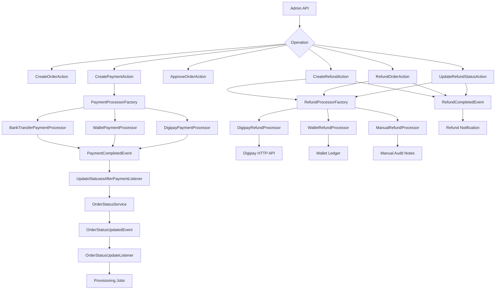
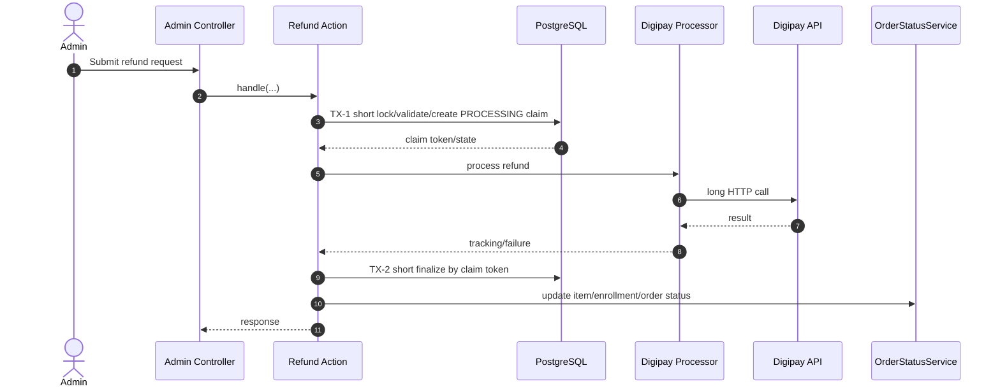
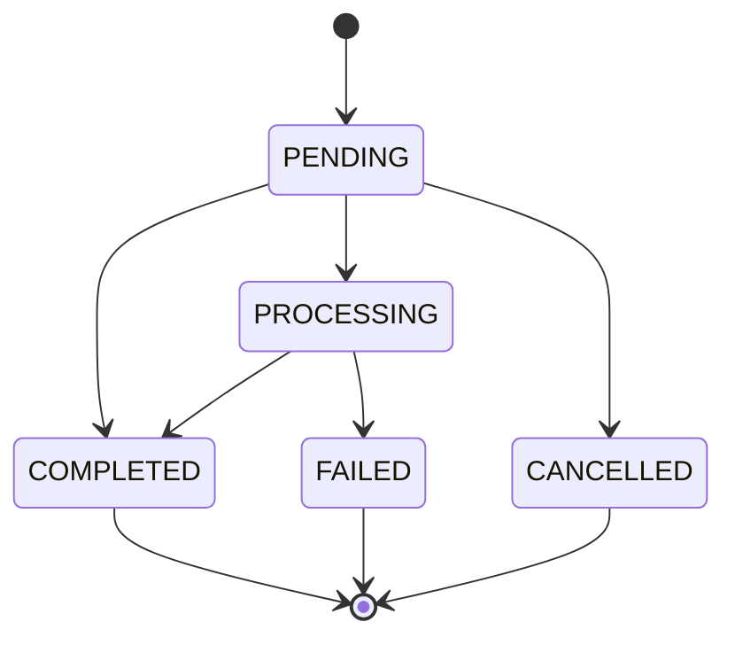

# Admin Order Management — Developer Guide

## Scope
Admin order creation, admin payment registration, manual approval, and refund lifecycle (single-item + full-order).

## Confirmed Domain Rules (authoritative)

1. Digipay refund/delivery uses long HTTP calls. Do **not** keep long DB locks during external calls.
2. Digipay refund policy is constrained business flow (full-order path or one-time allowed item-refund flow by policy).
3. Deduction is always based on product original/main price at purchase time (not paid amount).
4. BNPL/CREDIT delivery guard is warning-oriented operationally; manual out-of-shop handling is acceptable.

---

## 1) Subsystem Flow Diagram

---

## 2) Key Execution Path

---

## 3) State Transitions

---

## 4) Edge Case & Failure Matrix

| Scenario | Expected Behavior | Operational Handling |
|---|---|---|
| Digipay timeout/hang | No long DB lock during external call | Retry/reconcile path |
| Gateway success, DB finalize fail | Emergency signal + recoverable state | Reconciliation job/command |
| Concurrent refund-complete requests | Idempotent token ownership prevents duplicate finalize | Return current terminal state |
| Same payment concurrent item refunds | Payment-scoped guard avoids cap race | Reject second request |
| BNPL/CREDIT without delivery-confirmed | Warning-only policy retained | Admin manual follow-up |
| Deduction with discount/prepayment | Still from original product price | No runtime override |

---

## 5) Developer Guardrails (Strict)

1. Enforce nested resource invariant: `payment.order_id == route order.id`.
2. Never hold long DB lock while waiting on Digipay HTTP.
3. Make refund completion idempotent (claim token + terminal no-op).
4. Merge `transaction_details`; never overwrite with empty payload.
5. Keep reconciliation flow for external-success/internal-failure cases.
