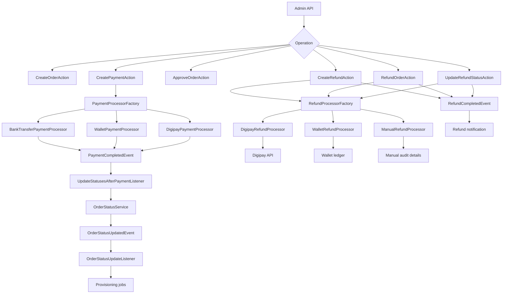
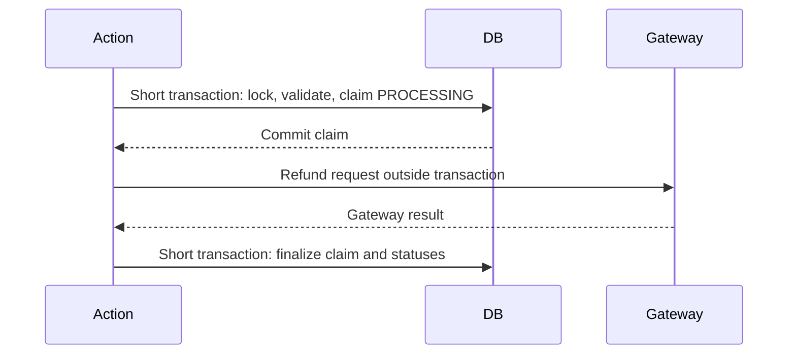
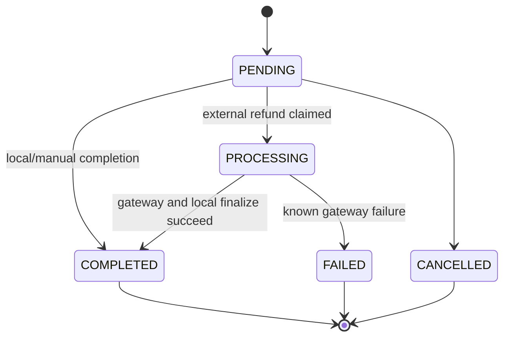

# Admin order and refund boundaries

> Supporting architecture note. For contracts and current implementation, use `docs/Digestions/`, code, configuration, and tests.

## Why this note exists

Admin flows can create or repair commercial state, but they must not bypass the same ownership, financial, and concurrency invariants used by storefront checkout.

## Code flow at a glance

## Invariants

- An order-scoped payment, item, or refund must belong to the order in the route. Nested binding is not an ownership check by itself.
- Status changes flow through the domain actions and the order status service. Direct model updates can skip reservation release, enrollment revocation, notifications, or parent-order aggregation.
- Refundable amounts are derived from the immutable order snapshot. Current catalog prices must never be used to reconstruct an old purchase.
- A refund may not exceed the completed amount for its payment after prior refunds. Concurrent refunds against the same payment must serialize this decision.
- Gateway policy is not interchangeable: Digipay, wallet, and manual refunds have different external and accounting consequences. Resolve the configured processor instead of branching in controllers.
- Admin approval changes fulfillment state only after the required payment threshold is met. It is not a generic override for unpaid orders.

## External refund boundary

Long-running gateway I/O must not occur while database locks are held.

The claim/finalize split exists because neither a database rollback nor an HTTP retry can undo a successful external refund. Finalization must be idempotent, and an external-success/internal-failure outcome must remain visible for reconciliation.

## Failure behavior

| Failure | Required result |
|---|---|
| Gateway timeout before a known result | Keep a reconcilable non-terminal record; do not assume success or issue an immediate duplicate refund. |
| Gateway succeeds, local finalization fails | Preserve the processing claim and emit high-severity telemetry for reconciliation. |
| Two refund requests race | Only the owner of the valid claim may call or finalize the external refund. |
| A terminal refund is submitted again | Return the existing outcome without repeating financial side effects. |
| Refund or cancellation revokes a purchased item | Recompute enrollment and parent-order state through the shared status path. |

## Change checklist

- Test nested-resource ownership and authorization separately.
- Test concurrent and repeated refund requests.
- Test the external-success/local-failure path.
- Keep transaction metadata additive; never erase a gateway reference with an empty payload.
