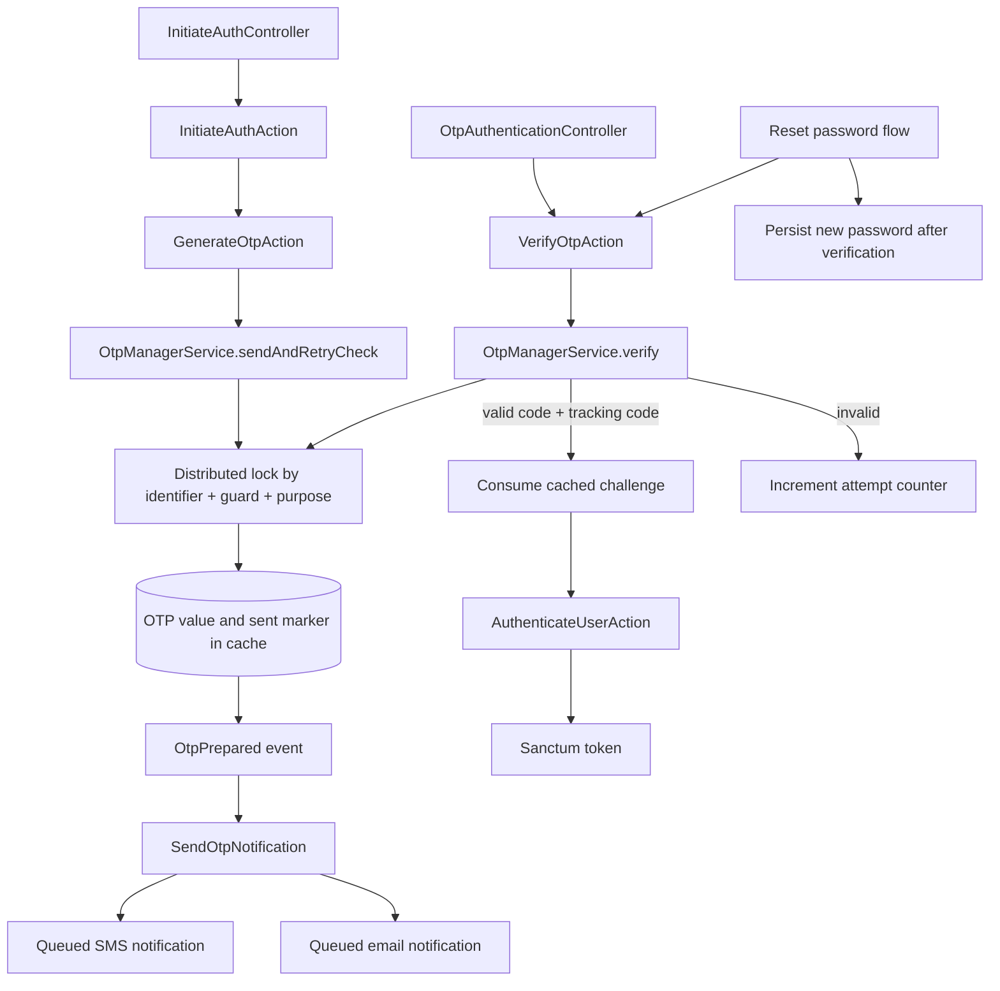
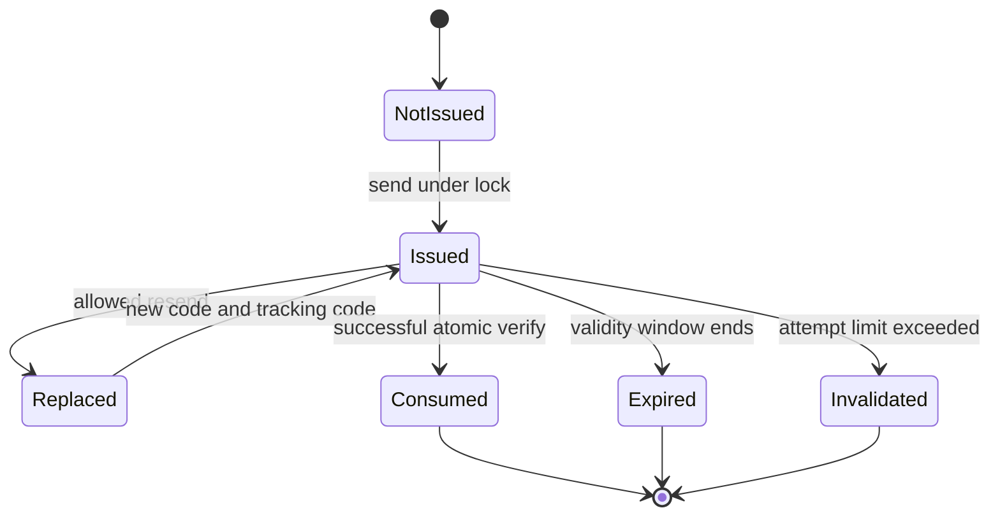
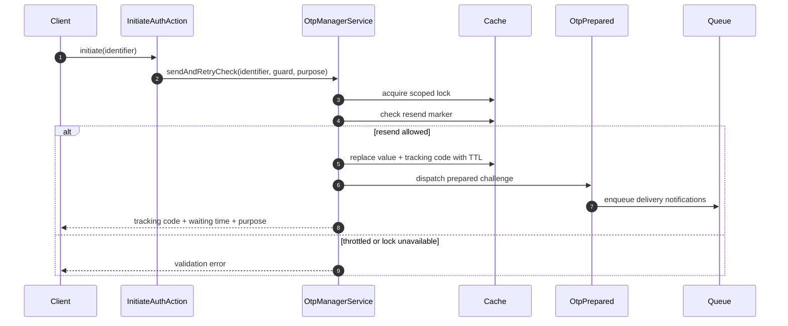

# Authentication and OTP boundaries

> Supporting architecture note. For contracts and current implementation, use `docs/Digestions/`, code, configuration, and tests.

## Security model

An OTP is identified by four dimensions: identifier, auth guard, OTP purpose, and tracking code. Matching only the numeric code is insufficient because resends replace the active challenge.

## Invariants

- Send, resend, and verify for the same identifier/guard/purpose share a distributed lock. A valid challenge has one successful consumer.
- The submitted numeric code and tracking code must both match the latest issued challenge.
- Code lifetime, resend delay, failed-attempt window, and lock duration are separate configuration concerns. Do not derive one security window from another.
- A successful verification consumes the code. A resend invalidates the usefulness of the previous tracking code.
- Failed verification counting must be atomic and bounded by an expiry window. Exceeding the limit invalidates the current challenge.
- Notification delivery is a side effect of preparing a challenge. Adding a delivery channel must not create another OTP state machine.
- Controllers choose the auth flow; the OTP service owns challenge state. Password reset and token issuance must reuse the same verification semantics.

## Failure behavior

| Failure | Required result |
|---|---|
| Concurrent resend | One request issues the replacement; the other is throttled or observes the new challenge. |
| Concurrent verification | At most one request consumes the valid challenge. |
| Cache lock cannot be acquired | Fail closed with a retryable validation response. |
| Notification transport fails | Record delivery failure without weakening verification or exposing the code. |
| Challenge is missing after its validity window | Report expiration and clear related attempt state. |

## Change checklist

- Cover resend and verify races with integration tests using a lock-capable cache store.
- Never log OTP values or include them in API responses outside explicitly controlled local/test behavior.
- Keep rate limits at both the route boundary and the identifier-scoped challenge boundary.
