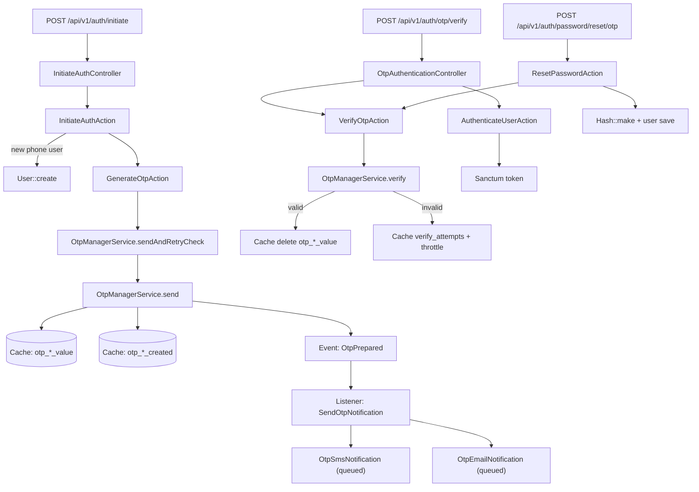
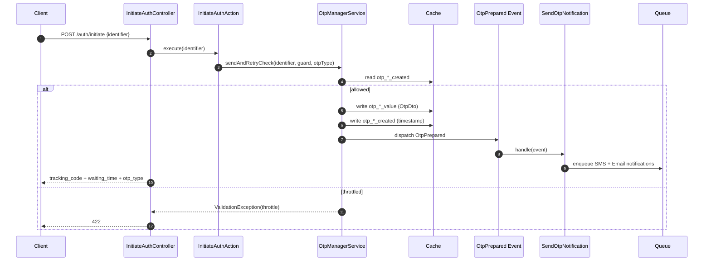
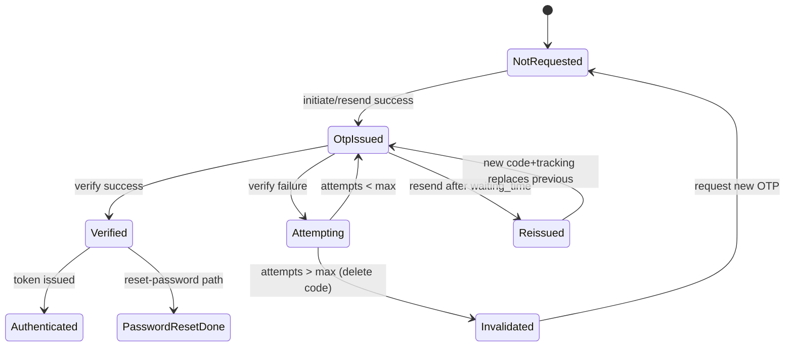

# Auth OTP Subsystem — Developer Architecture Spec

## 1) Subsystem Flow Diagram

## 2) Key Execution Path

## 3) State Transitions

## 4) Edge Case & Failure Matrix

| Case | Current Behavior | Risk | Required Handling |
|---|---|---|---|
| Concurrent resend calls | `sendAndRetryCheck` does read-then-send without lock | Duplicate sends, stale first tracking code | Wrap send path with distributed lock (`Cache::lock`) keyed by identifier+guard+type |
| Concurrent verify with same valid OTP | Verify checks then deletes; no atomic consume | Double success/token issuance race | Atomic compare-and-consume (single winner) |
| OTP cache TTL missing | `Cache::put(...value)` and `...created` with no TTL | OTP may persist indefinitely; replay window | Add explicit OTP TTL (e.g., 300s) on both keys |
| Failed-attempt counter race | `Cache::get + 1` then `put` | Lost increments under concurrency | Use atomic increment and bounded TTL window |
| Lockout window tied to `waiting_time=10s` | attempts key TTL = waiting_time | Practical brute-force over time | Separate verify lockout config (`attempt_window_seconds`) |
| Route abuse (initiate/resend/verify) | No route throttle middleware | SMS/email bombing, infra cost | Apply route throttles per IP + identifier buckets |
| Reset-password save failure after verify | OTP consumed before password save | User loses valid OTP on transient DB error | Transactional flow or delayed consume on commit |
| Missing user in notification listener | `$user` dereferenced before null-check | runtime error path | Null-guard + explicit failure telemetry |

## 5) Developer Guardrails (Strict Dos / Don’ts)

1. **Do** keep OTP lifecycle in `OtpManagerService`; **Don’t** duplicate OTP state logic in controllers/actions.
2. **Do** use atomic primitives for resend/verify mutation paths; **Don’t** add new read-then-write cache flows.
3. **Do** keep OTP TTL, throttle, and attempt window as explicit config keys; **Don’t** couple security windows to `waiting_time`.
4. **Do** preserve single-success semantics for verify (one valid code → one successful consume); **Don’t** allow multi-success races.
5. **Do** add/maintain Pest tests for concurrency-sensitive behavior (resend race, verify race, lockout); **Don’t** ship OTP changes without feature + integration coverage.

---

### File anchors (current implementation)
- `app/Services/OtpManagerService.php`
- `app/Actions/Auth/InitiateAuthAction.php`
- `app/Actions/Auth/VerifyOtpAction.php`
- `app/Actions/Auth/ResetPasswordAction.php`
- `app/Listeners/SendOtpNotification.php`
- `routes/Api/V1/auth.php`
- `config/otp.php`
