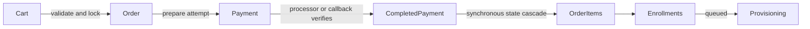
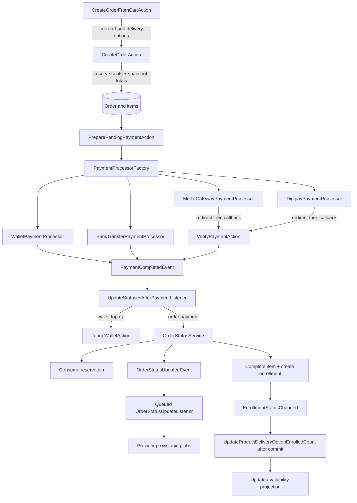
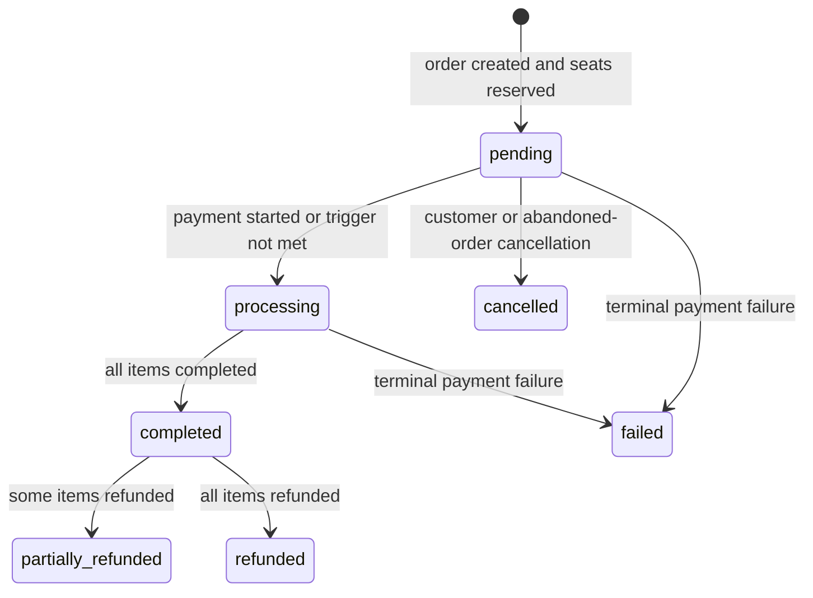
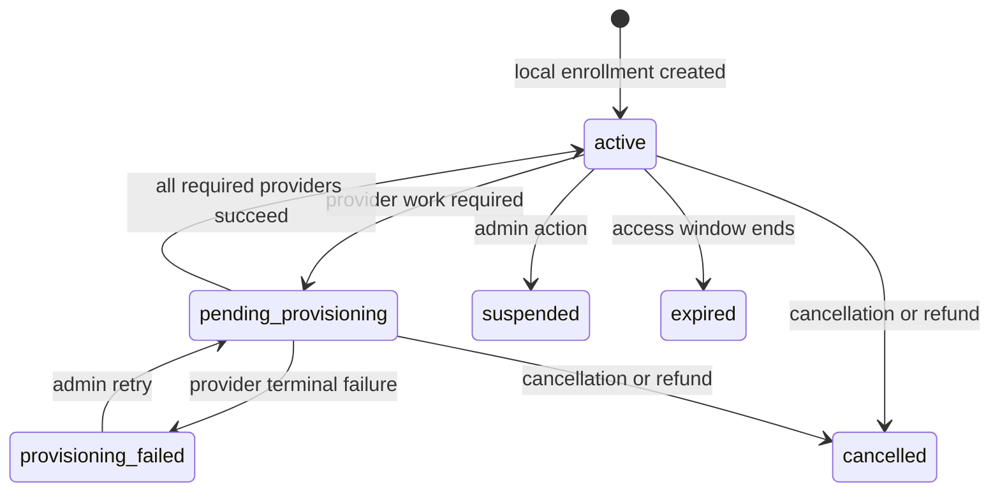

# Checkout, order, and payment boundaries

> Supporting architecture note. For contracts and current implementation, use `docs/Digestions/`, generated API documentation, code, configuration, and tests.

## Boundary model

The order is a commercial snapshot, the payment is an attempt to settle it, and the enrollment is the fulfillment entitlement. These records have separate lifecycles and must not be collapsed into a single transaction or status flag.

## Completion cascade at a glance

## Checkout invariants

- A cart is mutable and does not reserve inventory. Order creation revalidates publication, visibility, registration and availability windows, duplicate ownership, quantity rules, and capacity.
- Limited capacity is protected by locking the delivery option and checking `enrolled_count + reserved_count + requested quantity`. Creating a pending order reserves seats; payment consumes the reservation; cancellation or abandonment releases it.
- Prices and applied discounts are copied into immutable order/item snapshots. Later catalog or promotion changes must not rewrite historical totals.
- Ownership is checked against the underlying productable, not only a delivery-option ID, so changing packaging does not allow duplicate entitlement.
- Order creation and seat reservation are one database boundary. Network payment processing begins only after that boundary commits.

## Payment invariants

- Every attempt is represented by a payment before a processor runs. The payment purpose distinguishes order settlement from wallet top-up; an order is not valid ownership for every payment.
- Wallet and free payments can complete synchronously. Redirect gateways remain pending until a verified callback.
- Verification locks the payment and only transitions a valid pending attempt. Repeated callbacks must not create a second completion cascade.
- The gateway callback payload is evidence, not proof. A processor must verify reference, amount, ownership, and gateway result according to its protocol.
- External gateway calls do not belong inside long database transactions.

## Completion and fulfillment

Payment completion first routes by payment purpose. Order payments update item, reservation, enrollment, and parent-order state synchronously; provisioning is queued only after the order reaches its configured fulfillment boundary. Wallet top-ups credit the ledger through their own idempotent path.

The provisioning trigger is a business configuration (`any_payment`, `full_payment`, or manual approval). Do not encode one trigger assumption in a controller, processor, or provider job.

## State consequences

| Event | Required consequences |
|---|---|
| Pending order created | Snapshot totals and reserve limited capacity. |
| Payment verified | Complete the payment once, then run the purpose-specific cascade. |
| Item completed | Consume its reservation and create/update its enrollment. |
| Order cancelled or abandoned | Release outstanding reservations and cancel affected entitlements. |
| Item refunded | Revoke its entitlement and recompute the parent order. |
| Provisioning fails | Keep the commercial payment complete; expose fulfillment failure for retry. |

## Change checklist

- Test the last-seat race and reservation release.
- Test duplicate callback delivery and amount/reference mismatch.
- Test free, wallet, and redirect-gateway completion through the same state consequences.
- Test each provisioning-trigger configuration when changing order completion.
- Never calculate historical financial values from current catalog rows.
