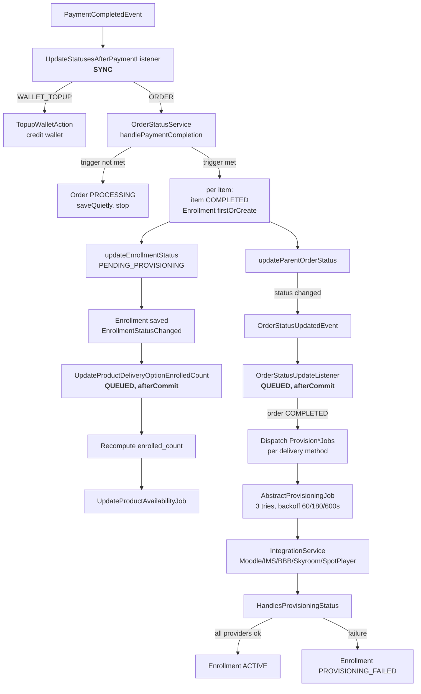
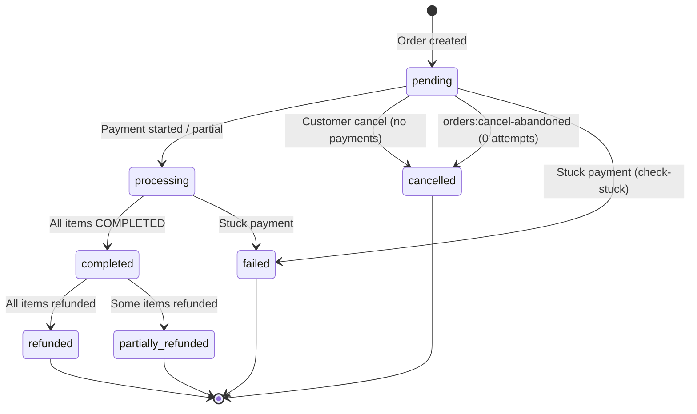
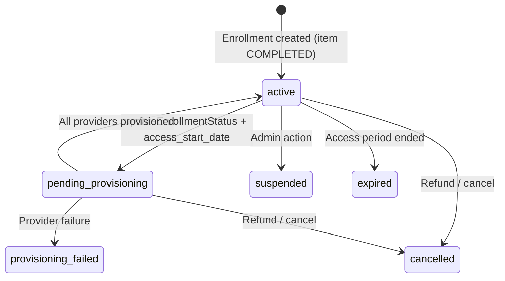

# Checkout, Order & Payment System — Developer Guide

> **Scope**: The full event-driven pipeline from cart submission through order creation, payment processing (4 gateways), status cascade, enrollment provisioning, refund/cancel, and scheduled maintenance.
>
> **Audience**: Backend developers onboarding to the checkout system. Assumes familiarity with Laravel 12, `spatie/laravel-data` DTOs, the Action pattern, and Pest testing.
>
> **Related docs**:
> - [`docs/Backend-Developer-Guide-Order-and-Discount-System.md`](Backend-Developer-Guide-Order-and-Discount-System.md) — Order creation + discount engine internals
> - [`docs/Payment-Gateway-Multi-Step-Architecture.md`](Payment-Gateway-Multi-Step-Architecture.md) — Multi-step gateway design rationale
> - [`docs/Refund-System-Architecture.md`](Refund-System-Architecture.md) — Refund flow detail
> - [`docs/WALLET_TOPUP_ARCHITECTURE.md`](WALLET_TOPUP_ARCHITECTURE.md) — Wallet topup path
> - `docs/Digestions/DIGEST_CORE_LOGIC.md` — Core business logic digest

---

## Table of Contents

1. [Business Context](#1-business-context)
2. [System Architecture Overview](#2-system-architecture-overview)
3. [Cart Layer](#3-cart-layer)
4. [Checkout Orchestrator](#4-checkout-orchestrator)
5. [Order Creation](#5-order-creation)
6. [Payment Processing](#6-payment-processing)
7. [Post-Payment Event Cascade](#7-post-payment-event-cascade)
8. [Enrollment Provisioning](#8-enrollment-provisioning)
9. [State Machines](#9-state-machines)
10. [Refund, Cancel & Retry](#10-refund-cancel--retry)
11. [Scheduled Maintenance](#11-scheduled-maintenance)
12. [API Surface](#12-api-surface)
13. [External Integrations](#13-external-integrations)
14. [Edge Cases & Failure Paths](#14-edge-cases--failure-paths)
15. [File Map](#15-file-map)
16. [Extending the System](#16-extending-the-system)
17. [Recent Changes & Architecture Notes](#17-recent-changes--architecture-notes)

---

## 1. Business Context

JeduShop sells educational products (courses, seminars, digital assets) through a three-layer catalog: **Productable** (academic blueprint) → **Product** (commercial shell) → **ProductDeliveryOption** (concrete SKU with price).

### Pre-Payment Model (Current)

Some courses support a **pre-payment** option (`OrderItemPaymentTypeEnum::PRE_PAYMENT`):

- Student pays only the **prepayment amount** online (via the shop).
- The remainder is settled **offline** — in person at our station. It is NOT recorded in the shop.
- A successful online payment means the order is **completed** — no further online payment is expected.

> **Implication for developers**: `Order::balance_due` currently equals `full_value_grand_total` for all PENDING orders (zero completed payments exist). The `balance_due` accessor and the `amountToPay` parameter on retry are **forward-compatibility hooks** for a future installment / online rest-payment feature, not current behavior. See [`#17 Recent Changes`](#17-recent-changes--architecture-notes) for the comments added to flag this.

### Provisioning Trigger Configuration

The system supports three provisioning strategies via `config('order.provisioning.trigger')`:

| Trigger | Behavior |
|---|---|
| `any_payment` (default) | Provision enrollments on every successful payment |
| `full_payment` | Defer provisioning until `balance_due <= 0` |
| `manual_approval` | Defer provisioning until admin runs `ApproveOrderAction` |

---

## 2. System Architecture Overview

### Architectural Patterns

1. **Action Pattern** — Single-purpose business logic classes in `app/Actions/`
2. **Strategy Pattern** — Pluggable payment processors behind `PaymentProcessorContract`
3. **Event-Driven** — `PaymentCompletedEvent` → `OrderStatusUpdatedEvent` → `EnrollmentStatusChanged`
4. **DTO-First API** — `spatie/laravel-data` for all request/response contracts; no Form Requests or API Resources
5. **Pessimistic Locking** — `lockForUpdate()` on cart, delivery options, payments during checkout
6. **Immutable Snapshots** — `OrderItem.product_data_snapshot_json` captures product state at purchase time

### High-Level Flow

```
HTTP Request → Controller (thin) → Action → Service/Processor → Model → Database
                                    ↓
                              Event::dispatch
                                    ↓
                              Listener (sync/queued)
                                    ↓
                              Status Cascade / Provisioning Jobs
```

### Key Design Principles

- **Controllers are thin** — they only parse input, delegate to an Action, and format the response via `apiResponse()`.
- **Business logic lives in Actions** — never in controllers or models.
- **Atomic payment + provisioning** — the sync `UpdateStatusesAfterPaymentListener` runs inside the payment transaction, so a cascade failure rolls back the payment too (safe for the customer).
- **Single source of truth for order status** — `OrderStatusService::updateParentOrderStatus()` recomputes order status from item statuses.
- **Queued listeners use `afterCommit = true`** — so jobs dispatched inside a transaction only execute after commit.

---

## 3. Cart Layer

### Purpose

The cart is a **temporary staging area** for items before checkout. It supports both guest users (via `X-Guest-Token` header) and authenticated users. On checkout, the cart is **deleted** — it does not persist after order creation.

### Key Files

| File | Role |
|---|---|
| `app/Models/Cart.php` | Cart model: `user_id` OR `guest_token`, `applied_coupon_code` |
| `app/Models/CartItem.php` | Line items: `product_delivery_option_id`, `payment_type`, `quantity` |
| `app/Services/CartService.php` | Cart CRUD, guest/user resolution, coupon apply/remove, totals via `OrderCalculationService`, race-tolerant cart creation (unique-constraint catch), `mergeGuestCart()` |
| `app/Contracts/CartIdentifier.php` | Contract resolving cart owner (user id vs guest token) |
| `app/Services/Cart/RequestCartIdentifier.php` | Request-based implementation (reads `X-Guest-Token` header) |
| `app/Http/Controllers/Api/Shop/Sale/CartController.php` | Cart HTTP endpoints (add/update/remove/coupon) |
| `app/Listeners/MergeGuestCartAfterLogin.php` | On `CustomerAuthenticatedEvent`: merge guest cart into user cart |
| `app/Events/CustomerAuthenticatedEvent.php` | Fired on login; triggers cart merge |

### Cart Resolution

```
Request → RequestCartIdentifier
         ↓
         Has user_id? → load user cart
         Has X-Guest-Token? → load guest cart
         Neither? → generate new guest_token, create cart
```

### Race Tolerance

`CartService::findOrCreateCart()` catches `QueryException` on the unique constraint (`user_id` + `guest_token`) and retries — handles the race where two concurrent requests try to create a cart for the same user.

### Guest Cart Merge

On login (`CustomerAuthenticatedEvent`), `MergeGuestCartAfterLogin` merges the guest cart items into the user's existing cart (or promotes the guest cart to a user cart if none exists).

---

## 4. Checkout Orchestrator

### Entry Point

```
POST /api/v1/shop/checkout
  → CheckoutController (thin)
  → CreateOrderFromCartAction::handle()
```

### `CreateOrderFromCartAction` — The Orchestrator

**File**: `app/Actions/Shop/CreateOrderFromCartAction.php`

This is the **single entry point** for shop-side checkout. It coordinates:

1. **Cart → Order conversion** (inside a DB transaction)
2. **Payment processing** (outside the order transaction)

#### Phase 1: Order Creation (DB Transaction)

```php
$order = DB::transaction(function () use ($user): Order {
    // 1. Lock cart for update
    $cart = $this->cartService->findOrCreateCart($user, lockForUpdate: true);

    // 2. Empty cart guard
    if ($cart->items->count() === 0) throw ValidationException::withMessages(...);

    // 3. Velocity check (max 5 orders/hour per user)
    $this->validateOrderVelocity($user);

    // 4. Per-item validation (published, registration window, capacity, availability)
    $this->validateCartItems($cart);

    // 5. Duplicate-purchase guard
    $this->validateNoDuplicatePurchases->handle($user, $deliveryOptions);

    // 6. Build OrderCreateData from cart items
    $orderCreateData = $this->buildOrderCreateData($cart, $user);

    // 7. Delegate to shared CreateOrderAction (price calc, locks, Order + OrderItems)
    $order = $this->createOrderAction->handle($orderCreateData);

    // 8. Delete cart (atomic with order creation)
    $cart->delete();

    return $order;
});
```

#### Phase 2: Payment Processing (Outside Transaction)

```php
return $this->processPayment($order, $checkoutData, $user);
```

`processPayment()` branches:

| Condition | Path |
|---|---|
| `grand_total <= 0` | Free order → `CompleteFreeOrderPaymentAction` (wrapped in its own transaction) |
| `payment_method` empty | 422 Validation error |
| Valid method | `PreparePendingPaymentAction` → `PaymentProcessorFactory->make()` → `processor->process()` |

### Validation Details

#### Velocity Check

Max 5 orders per hour per user. Prevents cart-spamming attacks.

#### Per-Item Validation (`validateCartItems`)

For each cart item, validates:
- Product is `PUBLISHED` and `is_visible`
- Delivery option is `PUBLISHED`
- Registration window (`registration_start_date` / `registration_end_date`)
- Content availability window (`available_from` / `available_to`)
- Capacity (`enrolled_count < capacity`)
- Quantity vs available capacity

#### Duplicate-Purchase Guard

`ValidateNoDuplicatePurchasesAction` blocks checkout if the customer already has an `ACTIVE` or `PENDING_PROVISIONING` enrollment for the same productable.

---

## 5. Order Creation

### `CreateOrderAction` — Shared Bill Creation

**File**: `app/Actions/Admin/Order/CreateOrderAction.php`

Shared by both **shop checkout** and **admin order creation**. Its only responsibility is to **record what the customer is buying** — it does NOT handle payments.

#### Flow

```
1. Calculate prices + discounts via OrderCalculationService
2. Validate no duplicate purchases
3. DB Transaction:
   a. For each item:
      - PESSIMISTIC LOCK + re-fetch delivery option (lockForUpdate)
      - Validate (published, registration, capacity, payment_type allowed)
      - Build OrderItem data (immutable snapshot, pricing metadata)
   b. Create Order (totals from context — single source of truth)
   c. Create OrderItems via $order->items()->createMany()
   d. Refresh order
4. Increment coupon/promotion usage counts (outside transaction)
5. Return order with items, payments, enrollments loaded
```

> **Note**: `OrderCreatedEvent` was previously dispatched here but had **zero listeners**. It was removed during the review cleanup. Enrollments are now created post-payment by `OrderStatusService`, not during order creation.

### `OrderIncrementIdService`

**File**: `app/Services/OrderIncrementIdService.php`

Generates sequential `increment_id` values (pattern: `100000001+`). This is the customer-facing order number, distinct from the UUID primary key.

### `OrderCalculationService`

**File**: `app/Services/Discounts/OrderCalculationService.php`

The **single source of truth** for item/order totals (subtotal, discount, grand total, full value). Shared by cart, order creation, and the discount engine.

---

## 6. Payment Processing

### Payment Processor Contract

**File**: `app/Contracts/Payment/PaymentProcessorContract.php`

```php
interface PaymentProcessorContract
{
    public function canHandle(PaymentMethodEnum $paymentMethod): bool;
    public function requiresRedirect(): bool;
    public function process(Payment $payment): PaymentProcessResultData;
    public function verify(Payment $payment, array $callbackData): Payment;
}
```

### Processor Factory

**File**: `app/Services/Payment/PaymentProcessorFactory.php`

Resolves the correct processor by iterating tagged processors (`payment.processors` tag) and calling `canHandle()`. Wired in `PaymentServiceProvider`.

### The 4 Processors

#### 1. WalletPaymentProcessor (Single-Step)

**File**: `app/Services/Payment/WalletPaymentProcessor.php`

```
process():
  1. Validate purpose === ORDER
  2. Re-entrancy guard (if already COMPLETED, return completed)
  3. DB Transaction:
     a. Duplicate-payment check (lockForUpdate on completed payments)
     b. Lock current payment row
     c. Generate transaction reference (PaymentTransactionReferenceService)
     d. RecordWalletTransactionAction (debit wallet — atomic balance/gift split)
     e. Update payment → COMPLETED
     f. Update transaction → COMPLETED
     g. PaymentCompletedEvent::dispatch($payment)  ← inside transaction
  4. Return completed result
```

**Key**: The event dispatch happens **inside** the DB transaction. The sync listener (`UpdateStatusesAfterPaymentListener`) runs within this transaction, so the entire payment + status cascade is atomic. A cascade failure rolls back the wallet debit too — safe for the customer.

#### 2. BankTransferPaymentProcessor (Single-Step)

**File**: `app/Services/Payment/BankTransferPaymentProcessor.php`

Immediately marks payment `COMPLETED` (admin verifies manually). Fires `PaymentCompletedEvent`.

#### 3. DigipayPaymentProcessor (Multi-Step)

**File**: `app/Services/Payment/DigipayPaymentProcessor.php`

```
process():
  1. DigipayClient->createTicket() → get redirect URL
  2. Create INITIATED PaymentTransaction
  3. Return pendingWithRedirect(payment, redirect_url)

verify():
  1. Parse CallbackPayload (amount, trackingCode, result)
  2. Duplicate-payment guard
  3. DigipayClient->verify()
  4. Amount cross-check (callback amount ≠ payment amount → FAILED)
  5. Update payment → COMPLETED
  6. PaymentCompletedEvent::dispatch()
```

#### 4. MellatGatewayPaymentProcessor (Multi-Step, SOAP)

**File**: `app/Services/Payment/MellatGatewayPaymentProcessor.php`

```
process():
  1. SoapClientFactory → create SOAP client
  2. bpPayRequest() → get RefId
  3. Create INITIATED PaymentTransaction
  4. Return pendingWithRedirect(payment, redirect_url, redirect_data, POST)

verify():
  1. ResCode check (0 = success)
  2. FinalAmount cross-check
  3. bpVerifyRequest()
  4. bpSettleRequest() (return 45 = already settled, OK)
  5. Update payment → COMPLETED
  6. PaymentCompletedEvent::dispatch()
```

### Free-Order Payment Path

**File**: `app/Actions/Payment/CompleteFreeOrderPaymentAction.php`

For orders with `grand_total <= 0`, creates a `COMPLETED` payment with `method = NO_PAYMENT` and dispatches `PaymentCompletedEvent`. This is **shared by both shop checkout and admin payment creation** to ensure consistent field population and atomicity.

```php
// Shared action — used by:
//   - CreateOrderFromCartAction (shop checkout, wrapped in DB::transaction)
//   - CreatePaymentAction (admin, runs inside admin's existing transaction)
CompleteFreeOrderPaymentAction::handle($order, $actor, $adminNotes);
```

### Payment Transaction References

**File**: `app/Services/PaymentTransactionReferenceService.php`

`generateFor($payment)` allocates a sequential numeric `transaction_reference` (starting at `200000001+`) and creates an `INITIATED` `PaymentTransaction` atomically using `lockForUpdate` on the last transaction row. This closes the race on gateway network round-trips where two concurrent payments might get the same reference.

---

## 7. Post-Payment Event Cascade

This is the **most critical part of the system** — the event-driven chain that transforms a payment into enrollments and triggers external provisioning.

### Event Flow Diagram



### Listener Registration

Listeners are auto-discovered by Laravel 12 (no manual `$listen` array in `EventServiceProvider`). Verified via `php artisan event:list`:

| Event | Listener | Mode |
|---|---|---|
| `PaymentCompletedEvent` | `UpdateStatusesAfterPaymentListener` | **Sync** |
| `OrderStatusUpdatedEvent` | `OrderStatusUpdateListener` | Queued (`afterCommit`) |
| `EnrollmentStatusChanged` | `UpdateProductDeliveryOptionEnrolledCount` | Queued (`afterCommit = true`) |
| `RefundCompletedEvent` | `SendRefundCompletedNotification` | Queued |
| `CustomerAuthenticatedEvent` | `MergeGuestCartAfterLogin` | Sync |

### `UpdateStatusesAfterPaymentListener` (Sync, Inside Transaction)

**File**: `app/Listeners/UpdateStatusesAfterPaymentListener.php`

```php
public function handle(PaymentCompletedEvent $event): void
{
    $payment = Payment::with('order')->find($event->payment->id);

    if ($payment->purpose === PaymentPurposeEnum::WALLET_TOPUP) {
        $this->topupWalletAction->handle($payment);
        return;
    }
    if ($payment->purpose === PaymentPurposeEnum::ORDER) {
        $this->orderStatusService->handlePaymentCompletion($order->fresh());
    }
}
```

**Why sync?** Running inside the payment transaction means a cascade failure rolls back the payment too. This is the **desired atomicity guarantee** — the customer never pays for something that didn't provision.

### `OrderStatusService` — The State Machine Core

**File**: `app/Services/OrderStatusService.php`

#### `handlePaymentCompletion(Order $order)`

1. Read `config('order.provisioning.trigger')`.
2. If trigger not met (`full_payment` + `balance_due > 0`, or `manual_approval`):
   - Set order to `PROCESSING` via `saveQuietly()`.
   - Return (no item completion, no enrollments).
3. If trigger met:
   - For each item: `completeOrderItemAfterPayment($item)`.
   - `updateParentOrderStatus($order->fresh())`.

#### `completeOrderItemAfterPayment(OrderItem $item)`

```php
1. Set item status = COMPLETED (saveQuietly)
2. If no enrollment exists:
   - enrollment()->firstOrCreate(
       ['order_item_id' => $item->id],
       [enrollment_status = ACTIVE, ...]
     )
3. updateEnrollmentStatus($item)
   → flips ACTIVE to PENDING_PROVISIONING
   → sets access_start_date = now()
   → calls $enrollment->save() (NOT quiet — fires EnrollmentStatusChanged)
```

> **Note**: The enrollment is created with `ACTIVE` status, then immediately flipped to `PENDING_PROVISIONING` by `updateEnrollmentStatus`. The `save()` fires `EnrollmentStatusChanged`, which queues `UpdateProductDeliveryOptionEnrolledCount` (with `afterCommit = true`, so safe inside the transaction).

#### `updateParentOrderStatus(Order $order)`

The **single source of truth** for order status. Recomputes status from item statuses via `determineOrderStatus()`:

| Item Statuses | Order Status |
|---|---|
| All `REFUNDED` | `REFUNDED` |
| All `CANCELLED` | `CANCELLED` |
| Any `REFUNDED` | `PARTIALLY_REFUNDED` |
| All `COMPLETED` | `COMPLETED` |
| Default | `PROCESSING` |

If status changed, saves order (fires model events) and dispatches `OrderStatusUpdatedEvent`.

---

## 8. Enrollment Provisioning

### Trigger

`OrderStatusUpdateListener` (queued, `afterCommit`) reacts to `OrderStatusUpdatedEvent`. If the order is `COMPLETED`, it dispatches provisioning jobs per item:

```php
foreach ($order->items as $item) {
    // IMS (if details_json has ims_course_code)
    ProvisionImsEnrollmentJob::dispatch($enrollment->id, $payment->id);

    // Delivery method → job
    match ($deliveryMethod) {
        LMS_MOODLE           => ProvisionMoodleEnrollmentJob::dispatch($enrollment->id),
        VIDEO_PLATFORM_SPOTPLAYER => ProvisionSpotPlayerEnrollmentJob::dispatch($enrollment->id),
        LIVE_SESSION_BBB     => ProvisionBbbEnrollmentJob::dispatch($enrollment->id),
        LIVE_SESSION_SKYROOM => ProvisionSkyroomEnrollmentJob::dispatch($enrollment->id),
    };

    // Moodle quiz (secondary provider, if applicable)
    if (has moodle_quiz_course_id) ProvisionMoodleQuizJob::dispatch($enrollment->id);
}
```

### Job Execution

**Base**: `app/Jobs/Provisioning/AbstractProvisioningJob.php`

- 3 tries
- Backoff: [60, 180, 600] seconds
- `UnrecoverableProvisioningException` → immediate fail (no retry)
- `HandlesProvisioningStatus` trait tracks per-provider success/failure in `provisioning_data`

### Outcome

| Condition | Enrollment Status |
|---|---|
| All required providers succeeded | `ACTIVE` |
| Any required provider failed | `PROVISIONING_FAILED` |

Every `Enrollment::save()` fires `EnrollmentStatusChanged` → `UpdateProductDeliveryOptionEnrolledCount` (queued) → recomputes `enrolled_count` → dispatches `UpdateProductAvailabilityJob`.

---

## 9. State Machines

### Order Status



**Derived fields**:
- `payment_status`: `PENDING` (0 paid) / `PARTIALLY_PAID` (partial) / `PAID` (`total_paid >= grand_total`)
- `balance_due`: `full_value_grand_total - total_paid`

### OrderItem Status

```
pending ──payment done + trigger met──► completed
completed/pending ──refund────────────► refunded
pending ──cancel──────────────────────► cancelled
```

Parent order status is ALWAYS recomputed from item statuses via `determineOrderStatus()`.

### Enrollment Status



### Payment Status

```
pending ──single-step OK / gateway verify OK / free(NO_PAYMENT)──► completed
pending ──gateway failure / amount mismatch / stuck / duplicate──► failed
```

### PaymentTransaction Status

```
initiated ──processor success──► completed
initiated ──processor failure──► failed
```

---

## 10. Refund, Cancel & Retry

### Refund Flow

**Entry**: Admin `POST /admin/orders/{order}/refund` → `RefundOrderAction`

```
1. Create Refund rows (status = PROCESSING)
2. Gateway call via RefundProcessorFactory:
   - DIGIPAY → DigipayRefundProcessor (gateway reverse/refund, BNPL/CREDIT delivery guard)
   - WALLET  → WalletRefundProcessor (RecordWalletTransaction credit)
   - MANUAL  → ManualRefundProcessor (log-only, admin wires out-of-band)
3. Re-lock transaction:
   - Refund → COMPLETED
   - OrderItem → REFUNDED
   - Enrollment → CANCELLED
   - Order status re-evaluated (REFUNDED or PARTIALLY_REFUNDED)
4. UpdateOrderRefundedAmountAction (recompute total_refunded)
5. RefundCompletedEvent → SendRefundCompletedNotification (queued → customer)
```

**File map**:
- `app/Actions/Admin/Refund/RefundOrderAction.php` — 3-phase refund orchestrator
- `app/Actions/Admin/Refund/{CreateRefundAction, UpdateRefundStatusAction, UpdateOrderRefundedAmountAction}.php`
- `app/Services/Payment/Refund/RefundProcessorFactory.php`
- `app/Services/Payment/Refund/{Digipay,Wallet,Manual}RefundProcessor.php`
- `app/Contracts/Payment/RefundProcessorInterface.php`

### Customer Cancel

**Entry**: `POST /shop/student/orders/{increment_id}/cancel` → `CancelOrderByCustomerAction`

- Only `PENDING` orders
- No completed payments
- Cancels enrollments
- Fires `OrderStatusUpdatedEvent`

### Retry Payment

**Entry**: `POST /shop/student/orders/{increment_id}/retry-payment` → `RetryPaymentController` → `RetryOrderPaymentAction`

- Only `PENDING` orders with `balance_due > 0`
- `amountToPay` defaults to `balance_due` (controller currently passes `grand_total` — safe today because PENDING orders have zero completed payments, so `balance_due === grand_total`)
- New `PENDING` payment created, processor dispatched
- `attempt_count` increments per method

> **Future note**: When installment payments ship, the controller should omit `amountToPay` to use the `balance_due` default. See comments in `RetryOrderPaymentAction` and `Order::balanceDue()`.

---

## 11. Scheduled Maintenance

### `orders:cancel-abandoned`

**File**: `app/Console/Commands/CancelAbandonedOrdersCommand.php`

Runs every 10 minutes. Cancels `PENDING` orders with **zero** payment attempts past the timeout window. Orders with failed/pending attempts are deliberately NOT cancelled (retry path).

### `payments:check-stuck`

**File**: `app/Console/Commands/CheckStuckPaymentsCommand.php`

Marks `PENDING` payments with a stale `INITIATED` transaction as `FAILED`. Logs for support investigation.

---

## 12. API Surface

### Routes

| Scope | File | Key Endpoints |
|---|---|---|
| Shop (public) | `routes/Api/V1/shop/shop.php` | `POST /checkout`, `GET|POST /payment/gateway/callback/{payment:uuid}`, `GET /payment/gateways`, cart CRUD |
| Customer (auth:user) | `routes/Api/V1/customer.php` | Orders index/show/cancel/retry-payment, payments index/show |
| Admin (auth:staff) | `routes/Api/V1/admin/sale.php` | Orders CRUD, preview, approve, payments, refunds, digipay ops |

### DTOs (Request/Response)

All API contracts use `spatie/laravel-data` DTOs. Key ones:

**Shop**:
- `app/Data/Shop/Cart/CheckoutData.php` — checkout request (payment_method, payment_data)
- `app/Data/Shop/Cart/CheckoutResponseData.php` — checkout response (order + redirect)
- `app/Data/Shop/Payment/GatewayCallbackData.php` — gateway callback (permissive array)
- `app/Data/Shop/Student/Payment/PaymentListData.php` — payment list request (purpose filter, per_page)
- `app/Data/Shop/Student/Order/RetryOrderPaymentData.php` — retry request (payment_method)

**Admin**:
- `app/Data/Admin/Order/{OrderCreateData, OrderUpdateData, OrderItemCreateData}.php`
- `app/Data/Admin/Payment/{PaymentCreateData, PaymentUpdateData, BankTransferPaymentData, PaymentProcessResultData}.php`
- `app/Data/Admin/Refund/{RefundCreateData, RefundUpdateData, RefundStatusUpdateData, RefundOrderData}.php`

### Policies

| Policy | Methods | Permissions |
|---|---|---|
| `OrderPolicy` | viewAny, view, create, update, approve, delete | `ORDER_*` |
| `PaymentPolicy` | viewAny, view, create, update, delete, refund, deliver, reverse, inquire | `PAYMENT_*` |
| `RefundPolicy` | viewAny, view, create, update, delete, updateStatus, skipGateway | `REFUND_*` |

> **Note**: Admin `PaymentController` (order-scoped) authorizes via `OrderPolicy` (e.g., `Gate::authorize('view', $order)`) because payments are accessed through the parent order. `PaymentPolicy`'s standard CRUD methods are available for future use; its custom verbs (`refund`, `deliver`, `reverse`, `inquire`) are used by `DigipayAdminController`.

### Response Files

`resources/responses/<scope>/<resource>/<action>.json` — Scribe API documentation examples:
- `shop/checkout/show.json`, `shop/order/{index,show,retry-payment}.json`, `shop/payment/{index,show,verify}.json`
- `admin/order/{index,show,preview,approve,next-payment-details}.json`, `admin/payment/{index,show,process-result}.json`, `admin/refund/*.json`

---

## 13. External Integrations

### Digipay REST API

**Client**: `app/Services/Payment/Digipay/DigipayClient.php`

- OAuth password grant + Basic client auth, token cached in `digipay_access_token` (TTL with 300s buffer)
- Endpoints: `createTicket`, `verify`, `deliver` (CREDIT type 5 / BNPL type 13), `refund`, `reverse`, `inquireRefund`
- Base URLs: `https://api.mydigipay.com` (prod) / `https://uat.mydigipay.info` (sandbox)
- Config: `config/payments.php` + `DigipayConfigRepository` (reads from `SettingsService`)

### Mellat SOAP Gateway

**Client**: `app/Services/Payment/SoapClientFactory.php` + `MellatGatewayPaymentProcessor.php`

- WSDL: `https://bpm.shaparak.ir/pgwchannel/services/pgw?wsdl` (test: `sandbox.banktest.ir`)
- Operations: `bpPayRequest` (init), `bpVerifyRequest`, `bpSettleRequest` (return 0 = success, 45 = already settled OK)
- Config from `SettingsService` (`SettingKeyEnum::MELLAT`), falls back to `config('payments.mellat')`

### Provisioning Services

`app/Services/Integrations/{Moodle,Ims,Bbb,Skyroom,SpotPlayer}Service.php` + `AbstractIntegrationService.php`

External LMS / live session / video platform client adapters. Test fakes in `app/Services/Fakes/`.

### Storefront Redirects

After gateway callback, customer is redirected to:
- `config('payments.redirect.success')` — on COMPLETED payment
- `config('payments.redirect.failure')` — on FAILED payment or error

---

## 14. Edge Cases & Failure Paths

| Scenario | Behavior |
|---|---|
| **Duplicate payment** | `DuplicatePaymentException` in Wallet process + Digipay/Mellat verify when order already has completed payment. `VerifyPaymentAction` early-returns COMPLETED payments. `RetryOrderPaymentAction` guards `balance_due <= 0`. |
| **Amount mismatch** | Digipay callback amount ≠ payment amount → transaction FAILED + payment FAILED. Mellat FinalAmount ≠ amount → same. |
| **Mellat settlement-after-verify failure** | Payment FAILED, critical log (funds may be captured but unsettled — manual intervention). |
| **Wallet insufficient balance** | `WalletInsufficientBalanceException` (balance/gift split) → 422 with shortfall metadata. Debit happens atomically after row lock. |
| **Stuck payments** | `payments:check-stuck`: PENDING payment + stale INITIATED txn → FAILED + log. |
| **Abandoned orders** | `orders:cancel-abandoned`: PENDING with NO payment records past timeout → CANCELLED. Orders with failed/pending attempts NOT cancelled (retry path). |
| **Callback mismatch** | `PaymentTransactionNotFoundException` when callback reference doesn't match any transaction → failure redirect. |
| **Free orders** | `CompleteFreeOrderPaymentAction` creates COMPLETED NO_PAYMENT payment + fires event → enrollments + provisioning run normally. Wrapped in DB transaction for atomicity. |
| **Pre-payment (partial)** | `payment_status` = PARTIALLY_PAID; provisioning trigger `full_payment` defers item completion until `balance_due <= 0`; `manual_approval` defers until `ApproveOrderAction`. |
| **Refund** | Deduction (amount/percent) support; `skip_gateway` appends manual note; gateway failure → refunds FAILED + `RefundValidationException`; gateway succeeded but DB commit failed → emergency log (money moved, DB stale); cumulative refund cap ≤ payment amount; BNPL/CREDIT refund guarded by delivery confirmation. |
| **Retry** | Only PENDING + positive balance; `attempt_count` increments per method; amount capped at `balance_due`. |
| **Provisioning** | 3 tries, backoff [60, 180, 600]; `UnrecoverableProvisioningException` bypasses retries → `PROVISIONING_FAILED`. |
| **Guest carts** | Merged on login (`MergeGuestCartAfterLogin`); race-tolerant cart creation via unique constraint catch; cart row locked during checkout conversion. |
| **Order velocity** | >5 orders/hour → 422. |
| **Wallet topup vs order** | Same `PaymentCompletedEvent`, listener branches on `purpose` (`WALLET_TOPUP` → credit; `ORDER` → status cascade). |

---

## 15. File Map

### A. Cart → Order Conversion

| File | Role |
|---|---|
| `app/Services/CartService.php` | Cart CRUD, guest/user resolution, coupon, totals, race-tolerant creation |
| `app/Contracts/CartIdentifier.php` | Cart owner resolution contract |
| `app/Services/Cart/RequestCartIdentifier.php` | Request-based implementation |
| `app/Actions/Shop/CreateOrderFromCartAction.php` | **Checkout orchestrator**: txn (lock, velocity, validate, duplicate, CreateOrderAction, delete cart) → processPayment (free / wallet / gateway) |
| `app/Actions/Admin/Order/CreateOrderAction.php` | Shared bill creation: price calc, pessimistic locks, Order + OrderItems, promotion usage increment |
| `app/Actions/Admin/Order/ValidateNoDuplicatePurchasesAction.php` | Blocks purchase if active/pending enrollment exists for same productable |
| `app/Services/OrderIncrementIdService.php` | Sequential increment_id generation (100000001+) |
| `app/Services/Discounts/OrderCalculationService.php` | Single source of truth for item/order totals |
| `app/Listeners/MergeGuestCartAfterLogin.php` | Guest cart merge on login |
| `app/Data/Shop/Cart/{CheckoutData, CheckoutResponseData}.php` | Checkout DTOs |
| `app/Http/Controllers/Api/Shop/Sale/{CheckoutController, CartController}.php` | HTTP entry points |

### B. Payment Initiation & Processors

| File | Role |
|---|---|
| `app/Actions/Payment/PreparePendingPaymentAction.php` | Creates PENDING Payment row |
| `app/Actions/Payment/CompleteFreeOrderPaymentAction.php` | Shared free-order payment creation (NO_PAYMENT + event, atomic) |
| `app/Services/Payment/PaymentProcessorFactory.php` | Resolves processor from `PaymentMethodEnum` |
| `app/Contracts/Payment/PaymentProcessorContract.php` | Interface: process, verify, requiresRedirect, canHandle |
| `app/Services/Payment/WalletPaymentProcessor.php` | Single-step: debit + COMPLETED + event (inside txn) |
| `app/Services/Payment/BankTransferPaymentProcessor.php` | Single-step: instant COMPLETED |
| `app/Services/Payment/DigipayPaymentProcessor.php` | Multi-step: createTicket → redirect; verify → COMPLETED |
| `app/Services/Payment/MellatGatewayPaymentProcessor.php` | Multi-step SOAP: bpPayRequest → redirect; verify+settle → COMPLETED |
| `app/Actions/Shop/RetryOrderPaymentAction.php` | Customer retry: PENDING + balance_due > 0 |
| `app/Actions/Admin/Payment/{CreatePaymentAction, UpdatePaymentAction, DeletePaymentAction}.php` | Admin payment ops |
| `app/Services/PaymentTransactionReferenceService.php` | Sequential transaction_reference (200000001+) with lockForUpdate |
| `app/Actions/Wallet/RecordWalletTransactionAction.php` | Atomic wallet ledger entry with balance/gift split |
| `app/Actions/Shop/Wallet/TopupWalletAction.php` | Credits wallet from COMPLETED WALLET_TOPUP payment |
| `app/Services/Payment/GatewayService.php` | Shop-facing enabled-gateway listing |
| `app/Providers/PaymentServiceProvider.php` | DI wiring: tagged processors, factory binding |

### C. Gateway Callback

| File | Role |
|---|---|
| `app/Http/Controllers/Api/Shop/Payment/GatewayCallbackController.php` | `GET|POST /payment/gateway/callback/{payment:uuid}`; uses `GatewayCallbackData`, calls `VerifyPaymentAction`, redirects to success/failure URLs |
| `app/Actions/Shop/Payment/VerifyPaymentAction.php` | Row-locks payment, early-return if COMPLETED, delegates `processor->verify()` |
| `app/Services/Payment/Digipay/Data/CallbackPayload.php` | Digipay callback DTO |

### D. Events, Listeners & Status Cascade

| File | Role |
|---|---|
| `app/Events/PaymentCompletedEvent.php` | Fired by all processors on completion |
| `app/Events/OrderStatusUpdatedEvent.php` | Fired by `OrderStatusService` on order status change |
| `app/Events/EnrollmentStatusChanged.php` | Fired from `Enrollment` model saved/deleting hooks |
| `app/Events/RefundCompletedEvent.php` | Fired by refund actions |
| `app/Listeners/UpdateStatusesAfterPaymentListener.php` | **Sync**; branches by purpose: WALLET_TOPUP→TopupWalletAction, ORDER→OrderStatusService |
| `app/Listeners/OrderStatusUpdateListener.php` | **Queued**; on COMPLETED order dispatches Provision*Jobs |
| `app/Listeners/UpdateProductDeliveryOptionEnrolledCount.php` | **Queued, afterCommit**; recomputes enrolled_count |
| `app/Listeners/SendRefundCompletedNotification.php` | **Queued**; notifies customer of completed refund |
| `app/Services/OrderStatusService.php` | **Order state machine core**: handlePaymentCompletion, updateEnrollmentStatus, updateParentOrderStatus |

### E. Enrollment Provisioning

| File | Role |
|---|---|
| `app/Jobs/Provisioning/AbstractProvisioningJob.php` | Base: 3 tries, backoff [60, 180, 600] |
| `app/Jobs/Provisioning/Concerns/HandlesProvisioningStatus.php` | Per-provider success/failure tracking |
| `app/Jobs/Provisioning/Provision{Moodle,Ims,Bbb,Skyroom,SpotPlayer}EnrollmentJob.php` | Per-provider provisioning jobs |
| `app/Jobs/Provisioning/ProvisionMoodleQuizJob.php` | Moodle quiz (secondary provider) |
| `app/Jobs/Provisioning/SyncMoodleProgressJob.php` | Periodic moodle progress sync |
| `app/Services/Integrations/{Moodle,Ims,Bbb,Skyroom,SpotPlayer}Service.php` | External client adapters |
| `app/Services/Fakes/*` | Test fakes |

### F. Refund, Cancel & Admin Approval

| File | Role |
|---|---|
| `app/Actions/Admin/Refund/RefundOrderAction.php` | 3-phase refund orchestrator |
| `app/Actions/Admin/Refund/{CreateRefundAction, UpdateRefundStatusAction, UpdateOrderRefundedAmountAction}.php` | Single-refund variants |
| `app/Services/Payment/Refund/RefundProcessorFactory.php` | Maps payment method → refund processor |
| `app/Services/Payment/Refund/{Digipay,Wallet,Manual}RefundProcessor.php` | Per-method refund processors |
| `app/Contracts/Payment/RefundProcessorInterface.php` | `process(Refund, Order, int): ?string` |
| `app/Actions/Shop/Student/CancelOrderByCustomerAction.php` | Customer cancel: PENDING only |
| `app/Actions/Admin/Order/ApproveOrderAction.php` | Manual-approval trigger |
| `app/Actions/Admin/Order/UpdateOrderAction.php` | Admin status edit |

### G. Digipay Client

| File | Role |
|---|---|
| `app/Services/Payment/Digipay/DigipayClient.php` | REST client: createTicket, verify, refund, deliver, reverse, inquireRefund |
| `app/Services/Payment/Digipay/DigipayAuthenticator.php` | OAuth token fetch + cache |
| `app/Services/Payment/Digipay/DigipayConfigRepository.php` | Credentials from Settings |
| `app/Services/Payment/Digipay/DigipayAdminService.php` | Admin ops wrapper |
| `app/Services/Payment/Digipay/Data/*.php` | API response DTOs |
| `app/Services/Payment/SoapClientFactory.php` | Mellat SOAP client factory |
| `config/payments.php` | Gateway config |

### H. Scheduled Maintenance

| File | Role |
|---|---|
| `app/Console/Commands/CancelAbandonedOrdersCommand.php` | `orders:cancel-abandoned` (every 10 min) |
| `app/Console/Commands/CheckStuckPaymentsCommand.php` | `payments:check-stuck` |

### I. Models & Enums

| File | Role |
|---|---|
| `app/Models/{Order, OrderItem, Payment, PaymentTransaction, Enrollment, Refund, Cart, CartItem}.php` | State carriers |
| `app/Enums/Order/{OrderStatusEnum, OrderPaymentStatusEnum, OrderItemStatusEnum, OrderProvisioningTriggerEnum, RefundStatusEnum, OrderItemPaymentTypeEnum}.php` | Order state enums |
| `app/Enums/Payment/{PaymentStatusEnum, PaymentMethodEnum, PaymentPurposeEnum, PaymentTransactionStatusEnum}.php` | Payment state enums |
| `app/Enums/EnrollmentStatusEnum.php` | Enrollment state enum |
| `app/Exceptions/Payment/*.php` | Payment exceptions |
| `app/Exceptions/Gateway/*.php` | Gateway exceptions |

---

## 16. Extending the System

### Adding a New Payment Gateway

1. Create a processor implementing `PaymentProcessorContract` in `app/Services/Payment/`.
2. Register it in `PaymentServiceProvider` with the `payment.processors` tag.
3. Add the method to `PaymentMethodEnum` (edit `config/permission-generator.php` if new permissions needed, run `sail artisan permission:generate`).
4. Add gateway config to `config/payments.php`.
5. If multi-step, implement `verify()` and add callback handling to `GatewayCallbackController`.
6. Add response JSON files in `resources/responses/`.
7. Write Pest tests using `AuthTestTrait`.

### Adding a New Provisioning Provider

1. Create a job extending `AbstractProvisioningJob` in `app/Jobs/Provisioning/`.
2. Create an integration service extending `AbstractIntegrationService` in `app/Services/Integrations/`.
3. Add dispatch logic to `OrderStatusUpdateListener` based on `delivery_method` or `details_json`.
4. Add a fake in `app/Services/Fakes/` for testing.

### Enabling Installment Payments (Future)

The system is pre-wired for installments:
- `Order::balance_due` accessor exists.
- `OrderProvisioningTriggerEnum::FULL_PAYMENT` defers provisioning until `balance_due <= 0`.
- `RetryOrderPaymentAction` accepts `?int $amountToPay` (defaults to `balance_due`).

To enable:
1. Update `RetryPaymentController` to omit `amountToPay` (let it default to `balance_due`) or accept an optional amount from `RetryOrderPaymentData`.
2. Decide whether partial payments should trigger provisioning (`any_payment` vs `full_payment` trigger).
3. Add admin UI for recording offline partial payments if needed.

---

## 17. Recent Changes & Architecture Notes

This section documents changes made during the checkout system review.

### #1. `OrderCreatedEvent` Removed (Dead Code)

**Before**: `CreateOrderAction` dispatched `OrderCreatedEvent`, but no listener was registered. The event class existed with zero consumers.

**After**: Event class deleted. Dispatch removed from `CreateOrderAction`. Tests updated to `assertNotDispatched`.

**Why**: Enrollments are created post-payment by `OrderStatusService`, not during order creation. The event was leftover from an earlier design.

**Files changed**:
- Deleted: `app/Events/OrderCreatedEvent.php`
- `app/Actions/Admin/Order/CreateOrderAction.php` — removed import + dispatch
- `tests/Integration/Actions/Order/CreateOrderActionTest.php` — flipped assertions

### #2. Sync Listener Inside Payment Transaction — Analyzed, No Change

**Concern**: `UpdateStatusesAfterPaymentListener` runs synchronously inside the wallet processor's DB transaction. Enrollment saves fire `EnrollmentStatusChanged` which dispatches a queued job inside the transaction.

**Analysis**: This is **safe and desirable**:
- Queued listeners use `afterCommit = true` (Laravel 11+ default for `ShouldQueue` listeners), so jobs only execute after the transaction commits.
- The sync cascade means a provisioning failure rolls back the payment too — **atomic guarantee** for the customer.
- The only inconsistency (free-order event dispatch outside transaction) was fixed in #3.

**No code change** — documented here to prevent future reviewers from re-flagging this as a bug.

### #3. Free-Order Payment Wrapped in Transaction

**Before**: `CreateOrderFromCartAction::createFreeOrderPayment()` dispatched `PaymentCompletedEvent` outside any transaction. Wallet processor dispatched inside a transaction. Inconsistent atomicity.

**After**: Free-order payment creation is wrapped in `DB::transaction()` and delegates to the shared `CompleteFreeOrderPaymentAction`.

**Files changed**:
- `app/Actions/Payment/CompleteFreeOrderPaymentAction.php` — **new shared action**
- `app/Actions/Shop/CreateOrderFromCartAction.php` — uses shared action, wraps in transaction
- `app/Actions/Admin/Payment/CreatePaymentAction.php` — uses shared action (runs inside admin's existing transaction)

### #4. Pre-Payment Model Documented (Comments Added)

**Context**: `Order::balance_due` and `RetryOrderPaymentAction::$amountToPay` are forward-compatibility hooks for future installment payments. Currently `balance_due === grand_total` for all PENDING orders.

**Comments added at**:
- `app/Models/Order.php` — `balanceDue()` accessor explains pre-payment model + future installments
- `app/Actions/Shop/RetryOrderPaymentAction.php` — `handle()` docblock explains `amountToPay` default + future installment note

### #5. Controller Contract Violations Fixed

**Before**:
- `ShowPaymentController::index()` accepted plain `Request`.
- `GatewayCallbackController::handle()` accepted plain `Request`; `GatewayCallbackData` existed but unused.

**After**:
- Created `app/Data/Shop/Student/Payment/PaymentListData.php` — request DTO for payment list (purpose filter, per_page).
- `ShowPaymentController::index()` now accepts `PaymentListData`.
- `GatewayCallbackController::handle()` now accepts `GatewayCallbackData` (redesigned to be permissive — accepts any gateway response shape).
- `GatewayCallbackData` rules are permissive (invalid `purpose` values pass through, `tryFrom` returns null in controller) to preserve existing behavior.

### #6. `PaymentPolicy` Standard CRUD Methods Added

**Before**: `PaymentPolicy` had only custom verbs (`refund`, `deliver`, `reverse`, `inquire`) used by `DigipayAdminController`. Standard CRUD verbs (`view`, `create`, `update`, `delete`) were missing.

**After**: Added `view`, `create`, `update`, `delete` methods to `PaymentPolicy` using existing `PAYMENT_*` permissions.

**Note**: Admin `PaymentController` (order-scoped) still authorizes via `OrderPolicy` (`Gate::authorize('view', $order)`) because payments are accessed through the parent order. This is intentional — tests use `ORDER_*` permissions and the access pattern is order-scoped. The new `PaymentPolicy` methods are available for future use if payment-level permissions are needed.

### #7. Missing `rules()` / `bodyParameters()` Added

| DTO | Before | After |
|---|---|---|
| `PaymentUpdateData` | No `rules()` | Added `rules()` with `PaymentStatusEnum` validation |
| `OrderItemCreateData` | No `bodyParameters()` | Added `bodyParameters()` for Scribe |
| `CheckoutData` | `payment_data` missing from `bodyParameters()` | Added `payment_data` entry |

### #8. Free-Order Payment Paths Consolidated

**Before**: Two duplicate free-order payment creation paths:
- `CreateOrderFromCartAction::createFreeOrderPayment()` (shop path)
- `CreatePaymentAction::createFreeOrderPayment()` (admin path)

Different field populations, no shared logic.

**After**: Both paths delegate to `CompleteFreeOrderPaymentAction::handle()`. Consistent field population, atomic event dispatch.

---

## Appendix: Verification

All changes verified via:
- `vendor/bin/sail bin pint --dirty --format agent` — formatting clean
- Full test suite — all tests pass
- `php artisan event:list` — listener registration confirmed

---

*Last updated: 14 Mordad 1405 (5 August 2026)*
