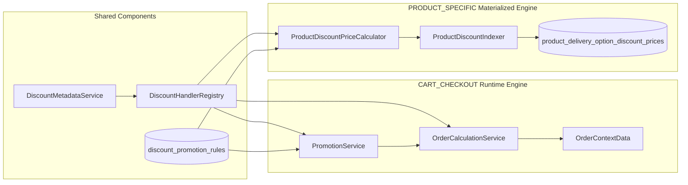
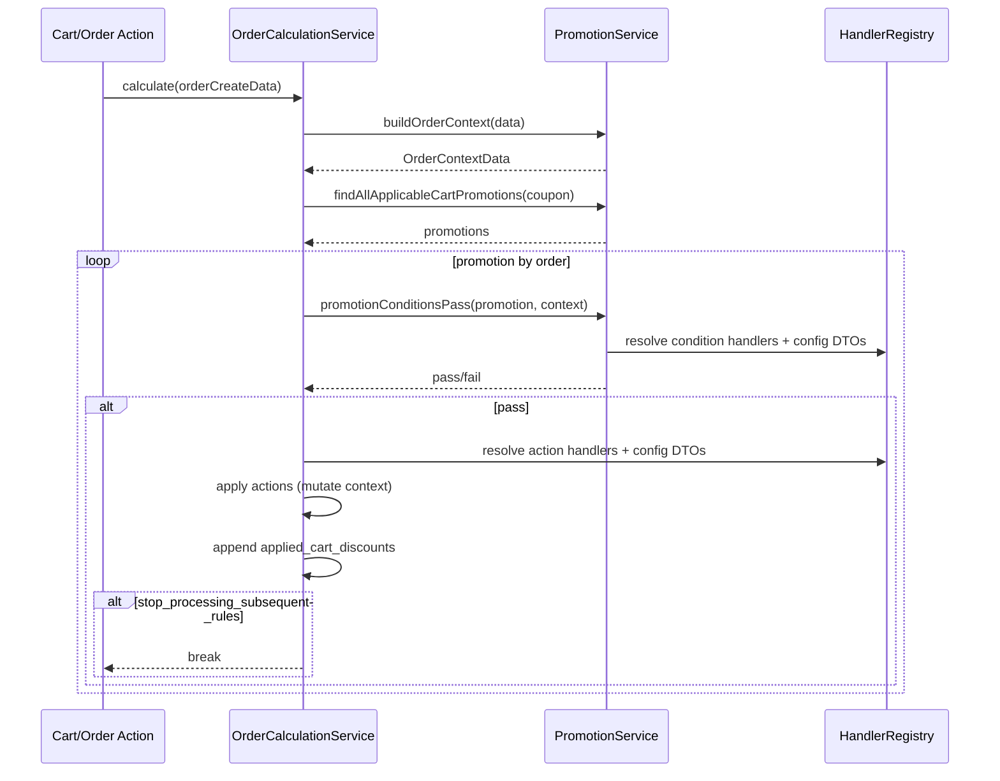
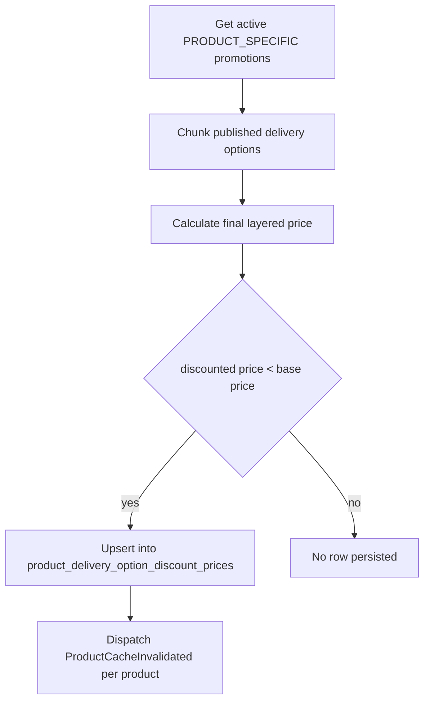
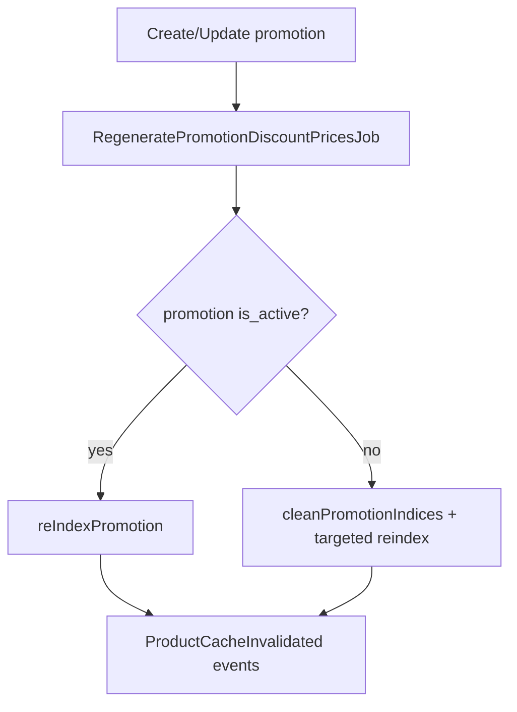

# Discount Promotion Engine - Architecture Guide

> **Scope**: End-to-end architecture of JeduShop discount promotions, including runtime cart discounts, materialized product discounts, handler discovery, indexing lifecycle, API touchpoints, and operational safety.
>
> **Audience**: Backend developers onboarding or modifying discount behavior in Laravel 12 + Pest stack.
>
> **Related docs**:
> - [`docs/Checkout-Order-Payment-System-Architecture.md`](Checkout-Order-Payment-System-Architecture.md) - Checkout/order/payment pipeline
> - [`docs/Backend-Developer-Guide-Order-and-Discount-System.md`](Backend-Developer-Guide-Order-and-Discount-System.md) - Combined order + discount overview
> - `docs/Digestions/DIGEST_CORE_LOGIC.md` - Actions/services digest
> - `docs/Digestions/DIGEST_DATA_MODELS.md` - Model and relationship digest

---

## Table of Contents

1. [Business Context](#1-business-context)
2. [Dual-Engine Architecture](#2-dual-engine-architecture)
3. [Core Data Model](#3-core-data-model)
4. [Handler Registry and Dynamic Discovery](#4-handler-registry-and-dynamic-discovery)
5. [Cart Runtime Engine (CART_CHECKOUT)](#5-cart-runtime-engine-cart_checkout)
6. [Product Materialized Engine (PRODUCT_SPECIFIC)](#6-product-materialized-engine-product_specific)
7. [Promotion Priority, Coupon Semantics, and Stacking](#7-promotion-priority-coupon-semantics-and-stacking)
8. [Regeneration and Cache Invalidation Lifecycle](#8-regeneration-and-cache-invalidation-lifecycle)
9. [Admin API Surface and Write Paths](#9-admin-api-surface-and-write-paths)
10. [Failure Modes and Guardrails](#10-failure-modes-and-guardrails)
11. [Testing Strategy and Coverage Map](#11-testing-strategy-and-coverage-map)
12. [File Map](#12-file-map)
13. [Extending the Engine Safely](#13-extending-the-engine-safely)

---

## 1. Business Context

JeduShop discounting serves two distinct business needs that look similar to users but are implemented differently in backend:

1. **Checkout-time promotions**
   - Applied during order preview/order creation.
   - Can include cart logic and non-price effects (gift item, wallet credit, gift credit).
   - Mutates order calculation context in memory.

2. **Storefront price optimization**
   - Precomputes active discounted prices for each published delivery option.
   - Stored in a dedicated table for fast reads and indexing.
   - Pure price transformation pipeline.

This split is intentional. Cart and product engines are not symmetrical by design.

---

## 2. Dual-Engine Architecture



### Design split

- **Runtime cart engine** executes at checkout flow and outputs financial context for order creation.
- **Materialized product engine** executes asynchronously and updates cacheable persisted discount prices.

---

## 3. Core Data Model

### Primary tables and models

| Model | Role |
|---|---|
| `DiscountPromotion` | Promotion root entity: type, active window, priority, coupon requirement, stop flag, usage limits |
| `DiscountPromotionRule` | Child rules with `type = condition|action`, handler key, config payload |
| `DiscountCoupon` | Coupon codes tied to promotion, active/usage controls |
| `ProductDeliveryOptionDiscountPrice` | Materialized final discounted price per delivery option |

### Key fields used by engine

- `discount_promotions.type`: `CART_CHECKOUT` or `PRODUCT_SPECIFIC`
- `discount_promotions.priority`: lower value means higher priority
- `discount_promotions.requires_coupon`: coupon gate for cart promotions
- `discount_promotions.stop_processing_subsequent_rules`: stop further stacking
- `discount_promotions.starts_at` / `ends_at`: active window
- `discount_promotions.usage_limit_total` + `total_usage_count`: global limit
- `discount_coupons.usage_limit` + `usage_count`: per-coupon limit

---

## 4. Handler Registry and Dynamic Discovery

### Registry role

`app/Services/Discounts/DiscountHandlerRegistry.php` provides dynamic mapping from string handler key to class/config DTO for four contract families:

1. Cart condition handlers
2. Cart action handlers
3. Product condition handlers
4. Product action handlers

### Discovery mechanism

1. Scan discovery paths from `config/discounts.php`.
2. Load PHP classes.
3. Keep only classes with `#[DiscountHandlerKey('snake_case_key')]`.
4. Bucket by implemented interface.
5. Resolve static `getConfigClass()` and map handler class -> config DTO.
6. Cache forever under `discounts.handler_registry.cache`.

### Caching behavior

- `app.debug = true`: rediscover each lifecycle for rapid development.
- non-debug: rely on persistent cache; clear via `discounts:clear-cache` when adding/changing handlers.

---

## 5. Cart Runtime Engine (CART_CHECKOUT)

### Entry points

- `OrderCalculationService::calculate(OrderCreateData)`
- Used by cart totals preview and order creation pipeline.

### Runtime flow



### Price source hierarchy in context build

`PromotionService::buildOrderContext()` uses `ProductPriceService::getPriceDataForOption()` so cart calculations start from current effective price (including featured/materialized price). Pre-payment lines use `prepayment_amount` for initial line total.

---

## 6. Product Materialized Engine (PRODUCT_SPECIFIC)

### Core components

- `ProductDiscountPriceCalculator`
  - Filters matching promotions by product conditions.
  - Sorts matching promotions by priority.
  - Applies actions sequentially.
  - Enforces non-negative final price.

- `ProductDiscountIndexer`
  - Full/single/targeted reindex entry points.
  - Chunks published delivery options by 1000.
  - Upserts per delivery option discounted snapshot.
  - Dispatches product cache invalidation event.

### Materialization flow



### Persistence semantics

- Table stores one best current discounted price snapshot per `product_delivery_option_id`.
- Row contains representative `discount_promotion_id` (best applicable in sorted list), not full applied-chain history.

---

## 7. Promotion Priority, Coupon Semantics, and Stacking

### Current enforced behavior

For cart promotions, `PromotionService::findAllApplicableCartPromotions()` now enforces:

1. **Phase 1**: non-coupon promotions (`requires_coupon = false`)
2. **Phase 2**: coupon promotions matched by provided coupon
3. Priority ascending inside phases

Query ordering:

```php
->orderBy('requires_coupon', 'asc')
->orderBy('priority', 'asc')
```

### Coupon hard gate

- If no coupon is provided, coupon-required promotions are excluded.
- If coupon is provided, only promotions with active matching coupon (and coupon usage availability) are eligible.

### Stop flag semantics

- `stop_processing_subsequent_rules = true` stops further promotion stacking after current promotion applies.
- Applies in both runtime cart engine and product calculator chain.

---

## 8. Regeneration and Cache Invalidation Lifecycle

### Promotion update path

`CreateDiscountPromotionAction` / `UpdateDiscountPromotionAction` dispatch `RegeneratePromotionDiscountPricesJob`.



### Full rebuild path

- Console command: `discounts:reindex-all`
- Service call: `ProductDiscountIndexer::reIndexComplete()`
- Optional sync of price index: `prices:index-all --sync` (default behavior in command)

---

## 9. Admin API Surface and Write Paths

### Key endpoints

| Endpoint | Role |
|---|---|
| `GET /api/v1/admin/discount-promotion` | List promotions |
| `POST /api/v1/admin/discount-promotion` | Create promotion + rules + schedule reindex |
| `PUT /api/v1/admin/discount-promotion/{id}` | Update promotion + schedule reindex |
| `DELETE /api/v1/admin/discount-promotion/{id}` | Delete promotion |
| `GET /api/v1/admin/discount-info/*` | Metadata for conditions/actions/operators/types |

### Write-side orchestrators

- `app/Actions/Admin/Discounts/CreateDiscountPromotionAction.php`
- `app/Actions/Admin/Discounts/UpdateDiscountPromotionAction.php`
- `app/Actions/Admin/Discounts/DeleteDiscountPromotionAction.php`

---

## 10. Failure Modes and Guardrails

| Scenario | Guardrail |
|---|---|
| Missing handler key/class | Runtime exception or false condition path depending layer |
| Missing config DTO mapping | Runtime exception in cart engine, warning/skip in product engine branches |
| Coupon exhausted | Excluded via usage checks |
| Promotion globally exhausted | Excluded via promotion usage checks |
| Promotion expired/not started | Excluded by date windows |
| Action yields negative price | Clamped to zero in product calculator |
| Handler cache stale in non-debug | Clear via `discounts:clear-cache` |

---

## 11. Testing Strategy and Coverage Map

### Core integration suites

- `tests/Integration/Services/Discounts/PromotionServiceTest.php`
- `tests/Integration/Services/Discounts/OrderCalculationServiceTest.php`
- `tests/Integration/Services/ProductDiscountIndexerTest.php`
- `tests/Integration/Services/ProductDiscountPriceCalculatorTest.php`
- `tests/Integration/Services/Discounts/LayeredPromotionSystemTest.php`

### Feature/E2E suites

- `tests/Feature/Api/V1/Shop/Sale/CartTest.php`
- `tests/Feature/Api/V1/Shop/Sale/ComplexCheckoutScenariosTest.php`
- `tests/Feature/Api/V1/Admin/Promotion/DiscountPromotionControllerTest.php`

### Rule/metadata/registry suites

- `tests/Integration/Rules/CheckDiscountConfigurationRuleTest.php`
- `tests/Integration/Services/DiscountMetadataServiceTest.php`
- `tests/Integration/Services/Discounts/DiscountHandlerRegistryTest.php`

---

## 12. File Map

### Core engine

| File | Responsibility |
|---|---|
| `app/Services/Discounts/PromotionService.php` | cart promo discovery + context build + condition pass |
| `app/Services/Discounts/OrderCalculationService.php` | runtime cart action application and audit output |
| `app/Services/Discounts/ProductDiscountPriceCalculator.php` | layered product-price calculation |
| `app/Services/Discounts/ProductDiscountIndexer.php` | materialized index maintenance |
| `app/Services/Discounts/DiscountHandlerRegistry.php` | dynamic handler/config DTO registry |
| `app/Services/Discounts/DiscountMetadataService.php` | admin metadata extraction |

### Jobs/commands

| File | Responsibility |
|---|---|
| `app/Jobs/Discounts/RegeneratePromotionDiscountPricesJob.php` | targeted regeneration per promotion |
| `app/Jobs/Discounts/RegenerateAllDiscountPricesJob.php` | full regeneration and cache clear |
| `app/Console/Commands/RegenerateDiscountPrices.php` | operator command (`discounts:reindex-all`) |
| `app/Console/Commands/Discounts/ClearHandlerCache.php` | clear dynamic handler cache |

### Tests

| File | Focus |
|---|---|
| `tests/Integration/Services/Discounts/PromotionServiceTest.php` | coupon gates and ordering |
| `tests/Integration/Services/Discounts/OrderCalculationServiceTest.php` | cart runtime behavior |
| `tests/Integration/Services/ProductDiscountIndexerTest.php` | materialization and window validity |
| `tests/Feature/Api/V1/Shop/Sale/ComplexCheckoutScenariosTest.php` | multi-step end-to-end coverage |

---

## 13. Extending the Engine Safely

### Add a new condition/action handler

1. Create handler under `app/Services/Discounts/...`.
2. Implement proper contract interface.
3. Add `#[DiscountHandlerKey('your_key')]`.
4. Implement static `getConfigClass()` on handler.
5. Create config DTO in `app/Services/Discounts/Configs/`.
6. Add tests for:
   - valid config behavior
   - invalid config behavior
   - engine-level integration path
7. Clear cache in non-debug: `vendor/bin/sail artisan discounts:clear-cache`.

### Modify stacking behavior

Always update both:

- service logic (`PromotionService` or calculator/indexer)
- integration tests (`PromotionServiceTest`, `OrderCalculationServiceTest`, `ProductDiscountIndexerTest`)

### Verification checklist

1. Run focused parallel tests for touched suites.
2. Run `vendor/bin/sail bin pint --dirty --format agent`.
3. Run broader `--filter=Discount` when behavior-level change is introduced.

---

*Last updated: 5 August 2026*
