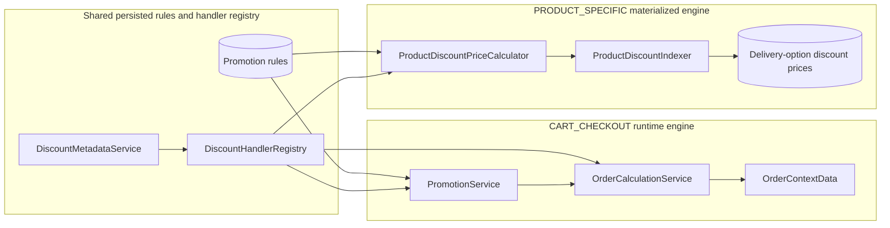
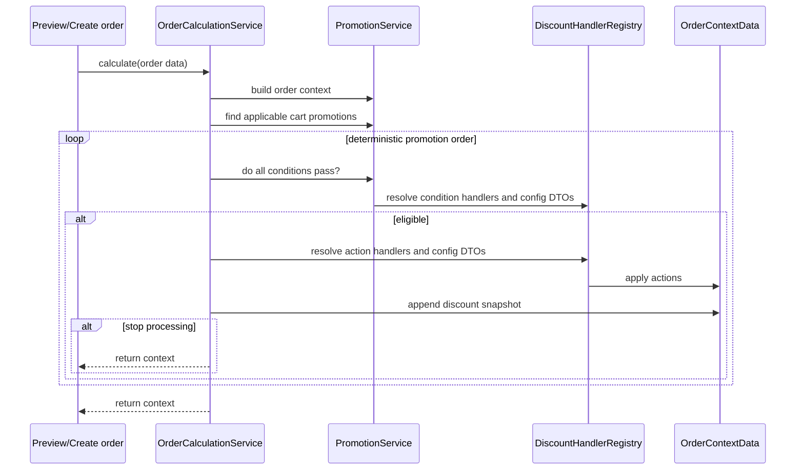
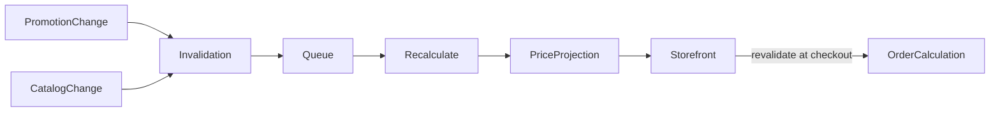
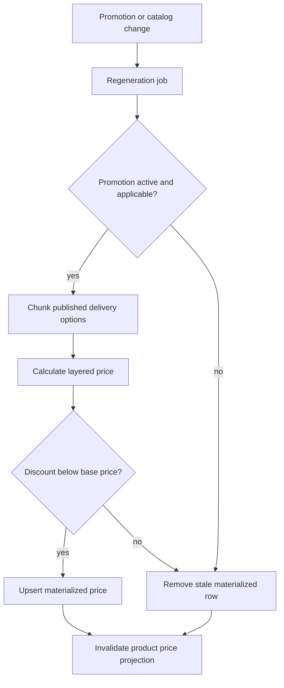

# Discount promotion boundaries

> Supporting architecture note. For contracts and current implementation, use `docs/Digestions/`, code, configuration, and tests.

## Two evaluation modes

The promotion model feeds two deliberately different engines:

| Mode | Evaluation time | Result |
|---|---|---|
| Cart/checkout | Re-evaluated while calculating an order | Mutates an in-memory order context and is snapshotted on the order. |
| Product-specific | Evaluated asynchronously when promotion/catalog inputs change | Materializes storefront price projections for fast listing and sorting. |

Do not reuse the materialized product price as proof that a cart promotion is valid. Checkout revalidates active windows, limits, coupon association, conditions, and current order context.

## Invariants

- Handler keys are persisted data. Renaming or removing a handler is a data migration, not a class-only refactor.
- Handler discovery, configuration DTO lookup, and execution must agree on the same key and engine type.
- Conditions decide eligibility; actions mutate a calculation context. A condition must not write prices, and an action must not silently decide unrelated eligibility.
- Applicable promotions are ordered deterministically. The stop-processing flag ends evaluation only after the current matching promotion has applied.
- A supplied coupon may activate only the promotion that owns an active, usable matching code. Coupon presence must not unlock other coupon-gated promotions.
- Usage counters change only when an applied discount is committed to an order. Preview calculations must be side-effect free.
- Order and item discount details are historical snapshots. Regeneration may change storefront projections, never existing orders.

## Projection lifecycle

Projection jobs must be safe to repeat. Deactivation, expiration, rule replacement, and deletion require removing or replacing stale rows, not only inserting new matches.

## Failure behavior

| Failure | Required result |
|---|---|
| Unknown persisted handler key | Fail visibly with promotion identity; do not silently apply a partial rule set. |
| Projection job fails | Storefront may use its defined fallback, but checkout remains authoritative. |
| Promotion changes during checkout | The locked order-creation calculation wins and is snapshotted. |
| Repeated rebuild | Same effective projection; no duplicate rows or accumulated discount. |
| Coupon belongs to another promotion | Coupon-gated promotion stays ineligible. |

## Change checklist

- Test preview versus committed usage counts.
- Test priority, stacking, stop-processing, and coupon isolation together.
- Test deactivation and deletion cleanup in the materialized engine.
- Preserve old handler keys or migrate persisted rules before removing them.
