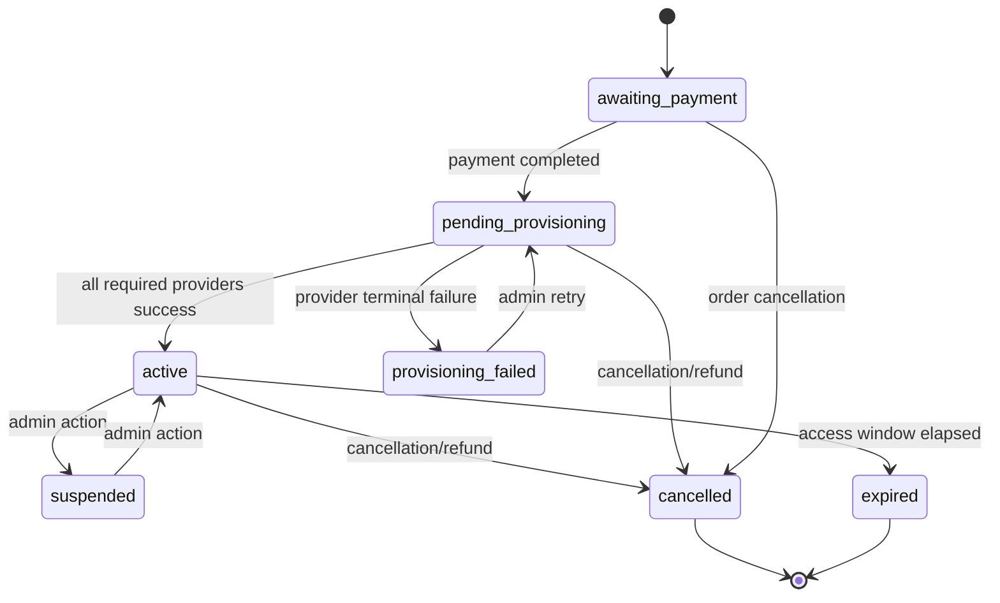

# Enrollment Provisioning System Architecture

## Overview

The enrollment provisioning system grants purchased access to external learning and delivery platforms after an order reaches completion. It is event-driven, queue-backed, provider-aware, and idempotent at the enrollment-provider level through persisted provisioning state.

Core goals:

- Convert paid `Enrollment` records from `pending_provisioning` to `active`.
- Route each enrollment to one or more required external providers.
- Distinguish recoverable vs unrecoverable external failures for correct retry behavior.
- Preserve per-provider provisioning outcomes to support targeted retries.

---

## Architectural Boundaries

- **Upstream trigger domain**: payment and order status lifecycle.
- **Provisioning domain**: enrollment state transitions and external access creation.
- **Downstream projection domain**: enrolled count and product availability updates via `EnrollmentStatusChanged`.

Primary integration providers:

- IMS
- Moodle (course)
- Moodle quiz (non-Moodle delivery with quiz attachment)
- SpotPlayer
- BigBlueButton (BBB)
- Skyroom

---

## Core Domain Model

### Enrollment (`app/Models/Enrollment.php`)

`Enrollment` is the provisioning aggregate root.

- Holds access ownership links: `order_id`, `order_item_id`, `customer_id`, `product_delivery_option_id`.
- Holds lifecycle fields: `enrollment_status`, `access_start_date`, `access_end_date`.
- Holds external trace fields: `external_enrollment_id`, `provisioning_data`.
- Generates UUIDv7 on creation.
- Dispatches `EnrollmentStatusChanged` on save and delete.

`provisioning_data` stores provider-level outcomes in JSON shape:

```json
{
  "providers": {
    "ims": {
      "status": "success",
      "provisioned_at": "2026-01-10 11:12:13",
      "data": {
        "course_code": "IMS-101"
      }
    },
    "moodle": {
      "status": "failed",
      "failed_at": "2026-01-10 11:13:20",
      "last_error": "...",
      "metadata": {}
    }
  }
}
```

### Enrollment Status Enum (`app/Enums/EnrollmentStatusEnum.php`)

Lifecycle states:

- `awaiting_payment`
- `pending_provisioning`
- `active`
- `suspended`
- `expired`
- `cancelled`
- `provisioning_failed`

Capacity-affecting states (`occupyingStatuses()`):

- `active`
- `pending_provisioning`
- `suspended`

---

## End-to-End Flow

### 1) Payment completion updates order

`UpdateStatusesAfterPaymentListener` handles `PaymentCompletedEvent`:

- For `WALLET_TOPUP`: routes to wallet top-up action.
- For `ORDER`: calls `OrderStatusService::handlePaymentCompletion()`.

### 2) Order completion triggers provisioning jobs

`OrderStatusUpdateListener` handles `OrderStatusUpdatedEvent`:

- Reads fresh order.
- Proceeds only when order status is `COMPLETED`.
- Iterates order items that have both enrollment and delivery option.
- Dispatches provider-specific provisioning jobs based on delivery method and option details.

### 3) Provider jobs execute through common job contract

Each provider job extends `AbstractProvisioningJob` and runs queued provisioning logic.

### 4) Provisioning state is written per provider

`HandlesProvisioningStatus` updates `provisioning_data.providers.<provider>` and adjusts enrollment status:

- Marks `active` only when all required providers are successful.
- Marks `provisioning_failed` on provider failure.

---

## Provider Routing Rules

Routing source: `OrderStatusUpdateListener`.

- If `details_json.ims_course_code` exists -> dispatch `ProvisionImsEnrollmentJob`.
- If delivery method is `LMS_MOODLE` -> dispatch `ProvisionMoodleEnrollmentJob`.
- If delivery method is `VIDEO_PLATFORM_SPOTPLAYER` -> dispatch `ProvisionSpotPlayerEnrollmentJob`.
- If delivery method is `LIVE_SESSION_BBB` -> dispatch `ProvisionBbbEnrollmentJob`.
- If delivery method is `LIVE_SESSION_SKYROOM` -> dispatch `ProvisionSkyroomEnrollmentJob`.
- If delivery method is not `LMS_MOODLE` and `details_json.moodle_quiz_course_id` exists -> dispatch `ProvisionMoodleQuizJob`.

---

## Required Provider Resolution

Required provider set is computed in `HandlesProvisioningStatus::requiredProviders()` and used to determine when enrollment can become `active`.

Rules:

- Include `ims` when IMS setting is enabled.
- Include `moodle` when delivery method is Moodle and Moodle integration is enabled.
- Include `spotplayer` when SpotPlayer delivery and integration is enabled.
- Include `bbb` when BBB delivery and integration is enabled.
- Include `skyroom` when Skyroom delivery and integration is enabled.
- Include `moodle_quiz` when delivery is not Moodle, `moodle_quiz_course_id` exists, and Moodle is enabled.

Implication:

- `active` is a multi-provider consensus state, not single-job success.

---

## Queue and Retry Contract

### Base Job (`app/Jobs/Provisioning/AbstractProvisioningJob.php`)

- Implements `ShouldQueue`.
- Retries: `tries = 3`.
- Backoff: `[60, 180, 600]` seconds.
- Handles unrecoverable errors by failing immediately.
- Defers recoverable errors to Laravel retry mechanism.
- On terminal failure, writes provider failure state and triggers job-specific `onFailed()` hook.

`handle()` behavior:

- `UnrecoverableProvisioningException` -> `fail()` now, no further retries.
- Other throwables (including `RecoverableProvisioningException`) -> retried by queue worker.

`failed()` behavior:

- Resolves enrollment.
- Writes provider failure payload into `provisioning_data`.
- Sets enrollment status to `provisioning_failed`.
- Logs failure details.
- Calls extensibility hook `onFailed()`.

---

## Exception Taxonomy

Base exception: `ExternalProvisioningException` with metadata container.

- `RecoverableProvisioningException`
  - Intended for transient failures.
  - Retries should continue until attempts exhausted.

- `UnrecoverableProvisioningException`
  - Intended for deterministic failures (invalid config, invalid payload/data, 4xx semantics).
  - Should fail immediately with no retry loop.

- `ResourceNotProvisionedException`
  - Specialized external provisioning error type.

This taxonomy separates "try again later" from "fix data/config first" and powers queue behavior consistency.

---

## Integration Adapter Layer

### Shared Adapter Base (`app/Services/Integrations/AbstractIntegrationService.php`)

- Resolves configuration from settings with config fallback.
- Exposes `isEnabled()` and `assertConfigured()`.
- Maps HTTP failures into recoverable vs unrecoverable exceptions.
- Sanitizes payload snippets for safe diagnostics.

Usage pattern in jobs:

- If provider disabled -> return silently (no failure).
- If enabled but config invalid -> throw unrecoverable.
- Execute provider call -> success or classified exception.

### Provider service responsibilities

- `ImsService`: student creation, enrollment creation, teacher attendance and grades APIs.
- `MoodleService`: user lookup/create, enrollment, course content fetch, completion and grade retrieval, login key.
- `SpotPlayerService`: license issuance and player access data.
- `BbbService`: meeting creation and join URL generation.
- `SkyroomService`: user create/find, room membership, login URL generation.

---

## Provider Job Responsibilities

- `ProvisionImsEnrollmentJob`
  - Builds IMS student and enrollment payloads.
  - Resolves payment context for invoice metadata.
  - Stores IMS external enrollment id.
  - Adds admin audit log entry in `onFailed()` with sanitized static message.

- `ProvisionMoodleEnrollmentJob`
  - Validates `moodle_course_id`.
  - Ensures Moodle user exists.
  - Enrolls user with optional start/end dates.
  - Stores Moodle context in provisioning payload.

- `ProvisionMoodleQuizJob`
  - Validates `moodle_quiz_course_id`.
  - Ensures Moodle user exists.
  - Enrolls into quiz course with open date window.

- `ProvisionSpotPlayerEnrollmentJob`
  - Validates `spot_id`.
  - Issues license and stores license output.

- `ProvisionBbbEnrollmentJob`
  - Validates `meeting_id`.
  - Optionally auto-creates meeting.
  - Stores BBB meeting context.

- `ProvisionSkyroomEnrollmentJob`
  - Validates `room_id`.
  - Ensures Skyroom user exists.
  - Adds user to room and stores mapping.

---

## State Machine



Transition authority:

- Payment/order listeners move enrollment into provisioning path.
- Provisioning status trait moves to `active` or `provisioning_failed`.
- Admin actions can suspend, reactivate, cancel, and retry.

---

## Manual Recovery and Admin Control

`RetryProvisioningAction` supports two recovery modes:

- If `provisioning_data` is `null`: dispatch all providers required by delivery details.
- If provider statuses exist: dispatch only failed providers.

Allowed source statuses for retry:

- `provisioning_failed`
- `pending_provisioning`

This preserves successful provider outcomes and avoids duplicate external calls.

---

## Side Effects and Projections

Every enrollment save/delete dispatches `EnrollmentStatusChanged`.

Downstream listeners/jobs consume this to keep projections current, including:

- delivery option enrolled count
- product availability recalculation

This keeps catalog capacity and access visibility aligned with provisioning outcomes.

---

## Operational Notes

- Queue worker reliability is required for provisioning completion.
- Provider enable flags control whether a provider is part of required-provider consensus.
- Provisioning state is durable in `provisioning_data`; retries are state-aware.
- Integration configuration is centralized in settings with config fallback.

---

## Primary Code Map

- Trigger listener: `app/Listeners/OrderStatusUpdateListener.php`
- Payment-to-order listener: `app/Listeners/UpdateStatusesAfterPaymentListener.php`
- Aggregate model: `app/Models/Enrollment.php`
- Status enum: `app/Enums/EnrollmentStatusEnum.php`
- Job base: `app/Jobs/Provisioning/AbstractProvisioningJob.php`
- Status trait: `app/Jobs/Provisioning/Concerns/HandlesProvisioningStatus.php`
- Provider jobs: `app/Jobs/Provisioning/Provision*Job.php`
- Integration adapters: `app/Services/Integrations/*Service.php`
- Retry action: `app/Actions/Admin/Enrollment/RetryProvisioningAction.php`
- Exception taxonomy: `app/Exceptions/Integrations/*ProvisioningException.php`
