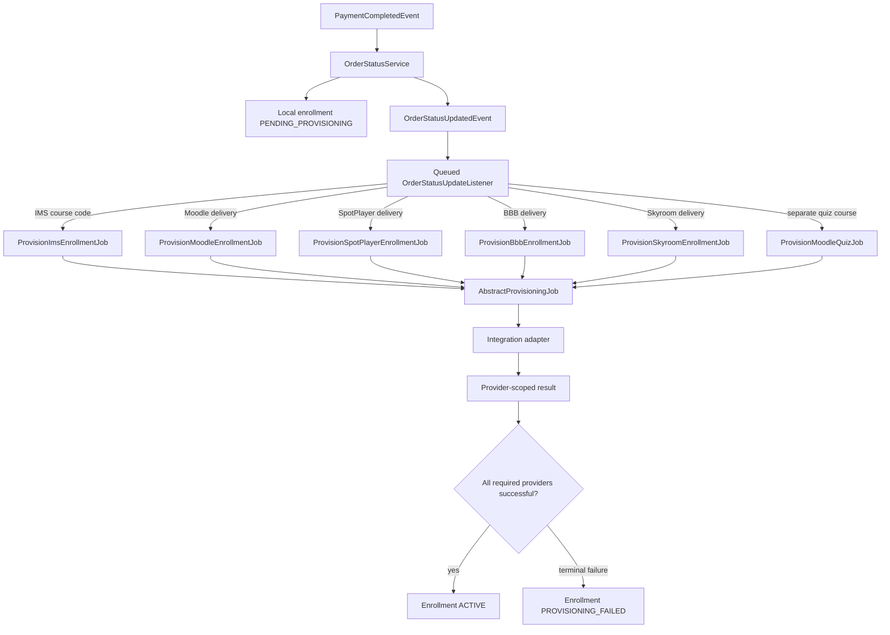
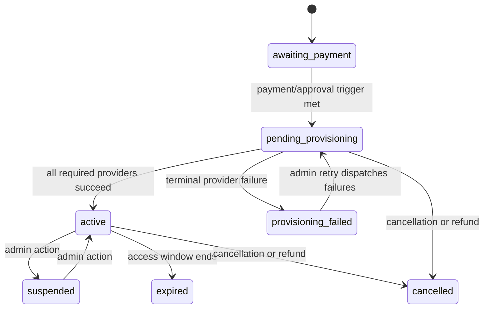

# Enrollment provisioning boundaries

> Supporting architecture note. For contracts and current implementation, use `docs/Digestions/`, code, integration configuration, and tests.

## Domain boundary

Payment grants a local entitlement; provisioning mirrors that entitlement into external systems. A provider outage must not roll back a completed commercial transaction.

## Invariants

- Enrollment creation and local status follow order-item state. Provider jobs do not decide whether an item was paid or refunded.
- A delivery option can require more than one provider, such as a primary delivery platform plus IMS or a separate Moodle quiz. Success is tracked per provider.
- The enrollment becomes active only when every currently required provider has succeeded. One provider's success must not erase another provider's failure.
- External identifiers and access data are provider-scoped. Do not store one provider's result in another provider's slot.
- Recoverable failures use queue retries and backoff. Invalid configuration or rejected input fails immediately and remains visible for an admin retry after correction.
- Manual retry targets failed providers. If provisioning was never attempted, it may dispatch the full required set.
- Cancellation/refund revokes the local entitlement even when external revocation needs separate operational recovery.

## Failure behavior

| Failure | Required result |
|---|---|
| Provider is temporarily unavailable | Retry without duplicating an already-created external entitlement. |
| Provider rejects configuration/data | Mark that provider failed and stop automatic retry churn. |
| One of several providers fails | Keep successful provider evidence and mark the aggregate enrollment failed/pending. |
| Queue dispatch never happened | Admin retry can reconstruct the required provider set. |
| Retry is requested for an active/cancelled enrollment | Reject it; retry is a recovery tool, not a status override. |

## Integration adapter contract

Adapters translate provider protocols and classify failures; jobs own retry behavior and persistence of provisioning outcome. Keep credentials in the settings/configuration layer, redact them from logs, and never return them in enrollment payloads.

## Change checklist

- Test repeated execution against a provider that already contains the user or entitlement.
- Test mixed success/failure for multi-provider delivery options.
- Test configuration-disabled and configuration-invalid cases separately.
- Preserve provider result history when retrying.
