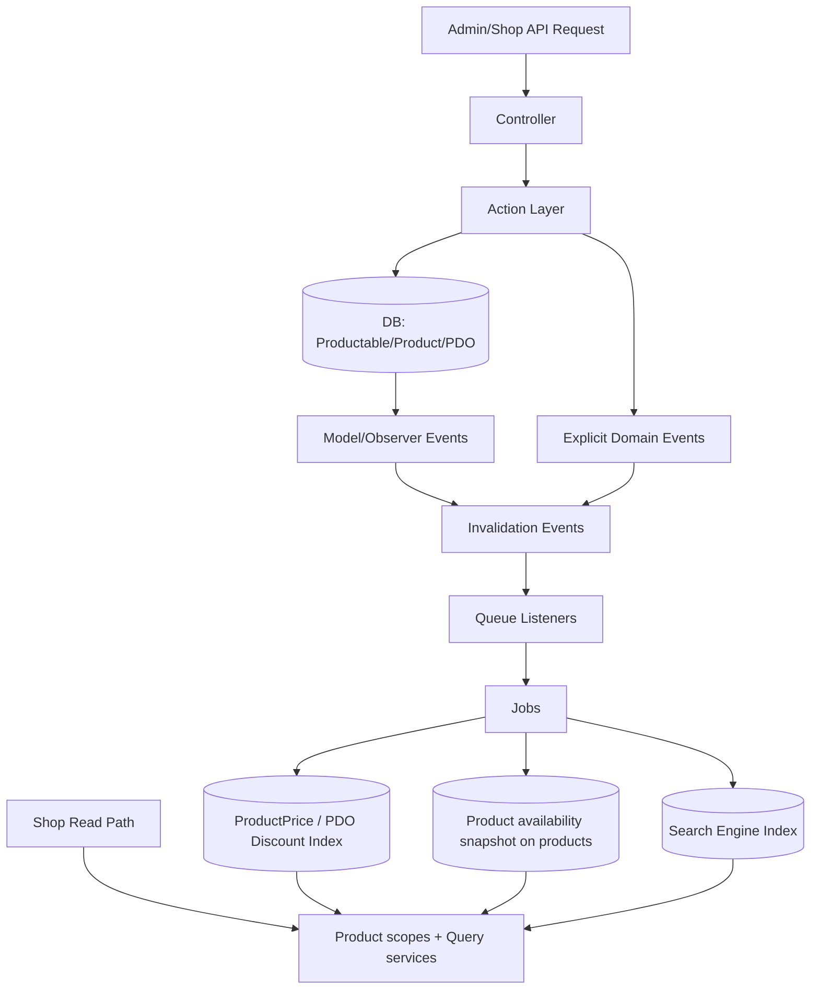
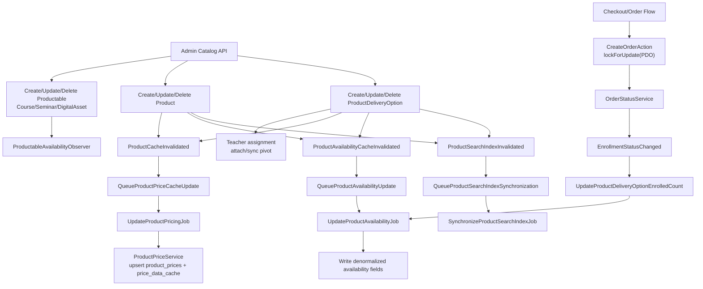
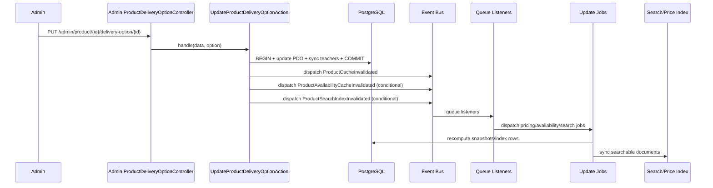
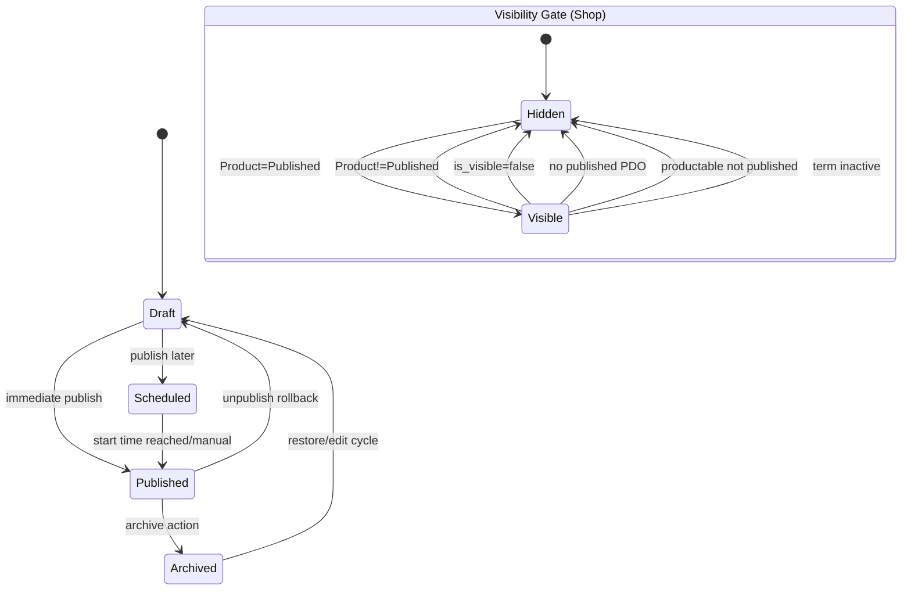

## Product Catalog Subsystem — Architecture Reference

### 1) Subsystem Flow Diagram 

#### High Level View

#### Detailed View

### 2) Key Execution Path

### 3) State Transitions

### 4) Edge Case & Failure Matrix (Expected/Intended Behavior)

| Case | Expected Behavior | Enforced By |
|---|---|---|
| Product is `published` but has zero published delivery options | Hidden from shop/search until a published PDO exists | Product visibility/search scopes + searchable gate |
| Product term is inactive | Product excluded from shop/search without deleting data | `activeTerm` scope + availability projection |
| Productable (course/seminar/asset) is not published | Product remains non-searchable/non-listable | `publishedProductable` scope + searchable gate |
| Registration window not started/ended | Checkout rejects item even if item exists in cart | `CreateOrderFromCartAction::validateCartItems` |
| Capacity reached | Checkout rejects with sold-out validation message | checkout validation against capacity/enrolled_count |
| Duplicate gateway callback for completed payment | Callback ignored / blocked, no second completion | Payment processor gatekeeper checks |
| Product delete when order items exist | Delete blocked with domain exception | `DeleteProductAction` guard |
| Category delete when mapped to entities | Delete blocked to preserve taxonomy integrity | `DeleteCategoryAction` guard |

### 5) Developer Guardrails (Strict Do/Don’t)

1. **DO** keep controllers thin; **DON’T** write catalog business logic in controllers.
2. **DO** mutate Product/Productable/PDO via Action classes + DTO validation; **DON’T** bypass with ad-hoc model updates.
3. **DO** dispatch side-effect events/jobs after successful persistence boundaries; **DON’T** introduce pre-commit queue side effects for catalog projections.
4. **DO** preserve snapshot/projection pipeline (price index, availability snapshot, search sync) when changing status/date/relationship fields; **DON’T** change write paths without updating invalidation triggers.
5. **DO** protect destructive paths with invariant guards (orders/enrollments/relations); **DON’T** rely only on FK cascades for access-critical records.
