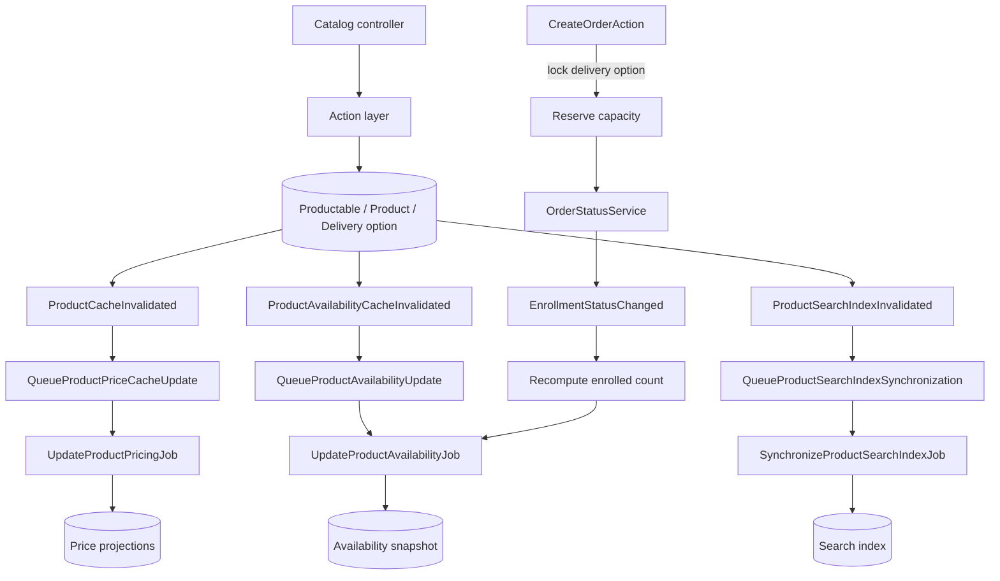
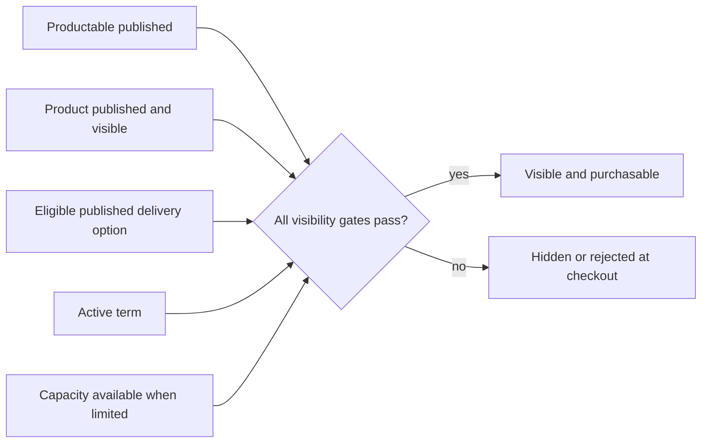
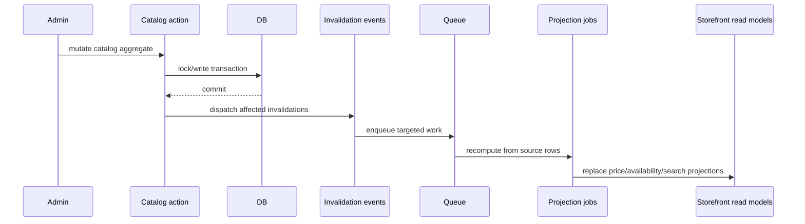

# Product catalog boundaries

> Supporting architecture note. For contracts and current implementation, use `docs/Digestions/`, code, schema, and tests.

## Three-layer model


- The productable owns educational/content identity.
- The product owns merchandising, vendor, taxonomy, and storefront identity.
- The delivery option owns a purchasable SKU: delivery method, price intent, capacity, registration window, and provider details.

These layers are not interchangeable. A new format or price for the same content is usually a delivery option, not a duplicate course or seminar.

## Write-to-read-model flow



## Visibility and availability

Storefront availability is an intersection, not a single status:

- the productable is publishable;
- the product is published and visible;
- at least one delivery option is published and within its relevant windows;
- its term and capacity constraints allow sale.

Catalog lists may use denormalized availability, price, and search projections. Checkout must revalidate live rows under lock; projections are never authorization to sell.



## Capacity invariant

For a limited option:

```text
enrolled_count + reserved_count <= capacity
```

Pending orders contribute to `reserved_count`; completed entitlements contribute to `enrolled_count`. Every order terminal path must consume or release its reservation exactly once.

## Projection boundary

Price, availability, and search documents are disposable read models. Domain writes emit invalidation only after persistence succeeds, and jobs recompute from source rows. Rebuilds must be idempotent and must remove stale projections when an entity becomes unavailable.



## Destructive changes

Do not delete or repurpose catalog records that appear in orders or enrollments. Historical order items carry snapshots, but relational identity still matters for fulfillment, refunds, and support. Prefer archival/unpublication where commercial history exists.

## Change checklist

- Decide explicitly which layer owns a new field.
- Update all affected projection invalidations when a source field changes.
- Test publish/unpublish in both directions and the last-seat race.
- Test that search/listing staleness cannot bypass checkout validation.
- Preserve productable-level duplicate ownership rules across delivery options.
