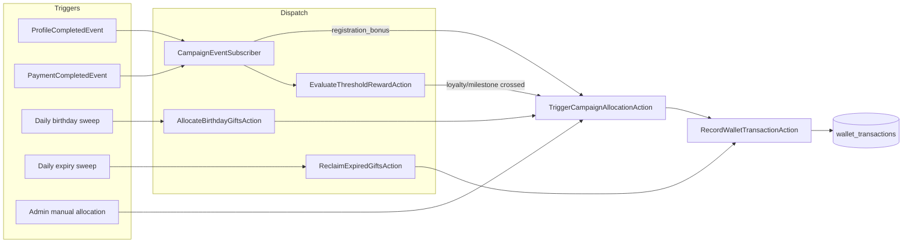
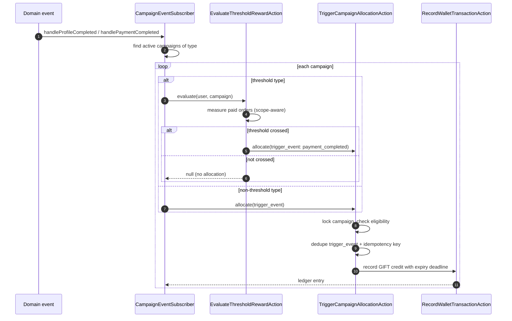
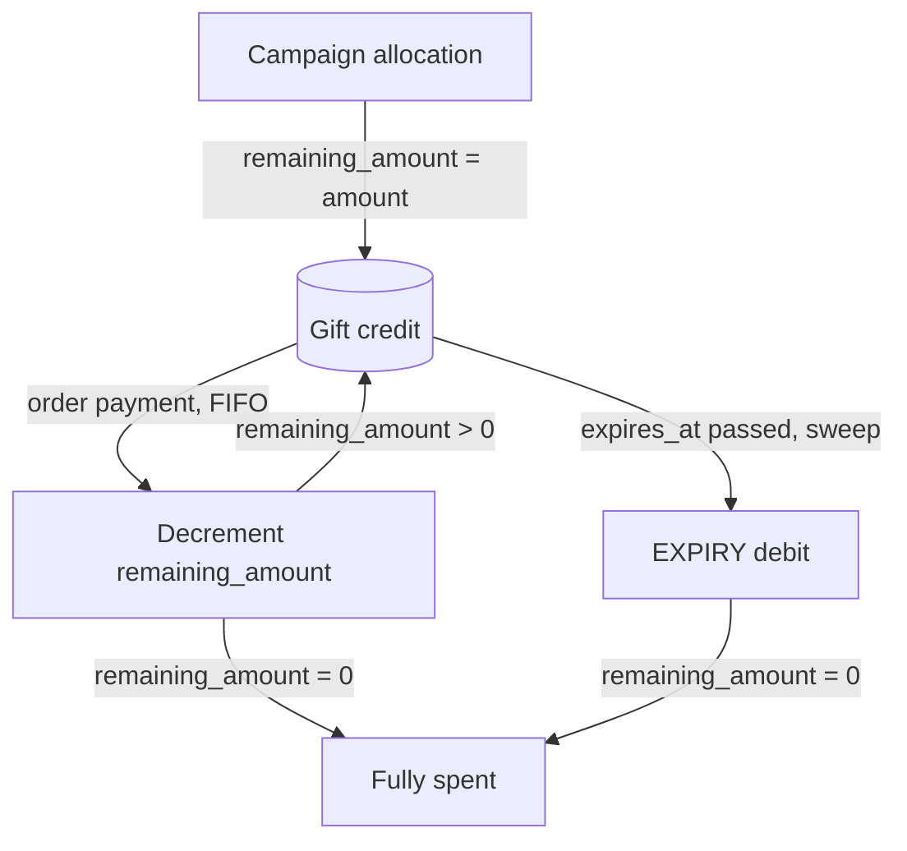

# Wallet campaign boundaries

> Supporting architecture note. For contracts and current implementation, use `docs/Digestions/`, code, schema, and tests.

## One allocation funnel, many triggers

A campaign gift is always a `GIFT` ledger credit produced by `TriggerCampaignAllocationAction`. Triggers decide *which* campaign and *why*; the allocation action alone decides *whether* (eligibility, limits, dedupe) and *records*. No trigger writes a gift credit directly.

`ReclaimExpiredGiftsAction` is the one trigger that bypasses the allocation funnel: it produces an `EXPIRY` debit through the shared ledger action, not a campaign credit.

## Campaign → trigger map

| Campaign type | Trigger | Condition |
|---|---|---|
| `registration_bonus` | `ProfileCompletedEvent` | first `false → true` transition of `User::profileCompleted()` |
| `loyalty_reward` | `PaymentCompletedEvent` | cumulative paid order total crosses `metadata.threshold_amount` |
| `milestone_reward` | `PaymentCompletedEvent` | paid order count crosses `metadata.threshold_order_count` |
| `birthday_gift` | daily sweep | `date_of_birth` month/day equals today |
| `manual_allocation` | admin | none |
| `referral_bonus` | (reserved) | blocked on the referral feature; only the mapping point is reserved |
| `seasonal_bonus` | (deferred) | recipient selection undefined |

A "paid order" is a completed ORDER-purpose payment. Wallet top-ups and non-completed payments never move loyalty/milestone thresholds.

Ineligible campaigns (inactive, expired, limits reached) and wallet-less users are logged and skipped inside the subscriber — one ineligible campaign never breaks the event flow.

## Gift lifecycle

Each `GIFT`/`BONUS` credit carries `remaining_amount` (its unspent slice) and `expires_at`. Spending and expiry both decrement `remaining_amount`; a gift is gone only when that slice reaches zero.

Order payments consume gift balance before normal balance, oldest gift first. A gift's expiry deadline resolves at allocation time: relative `metadata.expiry_days` (days from receipt) wins over absolute `ends_at`; with neither, the gift never expires.

## Invariants

- Every campaign credit flows through `TriggerCampaignAllocationAction`. No trigger constructs a `GIFT` transaction itself.
- The event → type mapping lives in `CampaignEventSubscriber::subscribe()`. Adding a campaign type means adding a map entry, not a new listener.
- Allocation is idempotent under retries and replayed events: a deterministic key (`wallet-campaign:{id}:user:{uid}:trigger:{type}:event:{event}`) plus a duplicate trigger-event check return the prior entry with no second credit.
- Threshold measurement is read-only; it never writes balances. Allocation is the only side effect of a crossed threshold.
- Threshold scope is honored at measurement: `lifetime` counts all history, `windowed` bounds the measure to `starts_at`..`ends_at`.
- Order payments spend gift before normal balance, oldest first (FIFO), decrementing each gift's `remaining_amount` and recording the split in metadata. Untracked gift balance (beyond any tracked `remaining_amount`) is consumed as untracked gift before normal balance.
- Expired unspent gift is reclaimed by a daily sweep as an `EXPIRY` debit through the shared ledger action, idempotent via `wallet-gift-expiry:{gift_id}`, and never exceeds the gift's unspent `remaining_amount`.
- A reclaim and an order payment racing for the same gift resolve inside the ledger action's wallet lock and `remaining_amount` clamp; the loser records nothing extra.

## Failure behavior

| Failure | Required result |
|---|---|
| Inactive/expired/limit-reached campaign at dispatch | Allocation skipped with a warning log; event flow and sweep continue. |
| Repeated event, callback, or sweep run | Deterministic key + trigger-event dedupe return the prior entry; no double credit. |
| Concurrent expiry reclaim vs order payment | Wallet row lock and `remaining_amount` clamp serialize; reclaim counted skipped, no over-reclaim. |
| Reclaim of a fully-spent gift | `GiftAlreadyFullyReclaimedException`; counted skipped. |
| Expiry references a missing gift | `GiftTransactionNotFoundException`. |
| Order payment exceeds combined funds | No partial debit; structured shortfall returned. |
| Threshold never crossed | `null`; no allocation, no usage increment. |

## Change checklist

- Add new campaign types to the subscriber map or a sweep action, never as bespoke listeners.
- Test idempotency (replay) and concurrency (sweep vs payment), not only sequential happy paths.
- Preserve FIFO order and `remaining_amount` tracking when touching order debits.
- Keep threshold measurement side-effect free; extend `resolveThreshold`/`measure` together.
- Preserve `EXPIRY` as an append-only debit; never repair balances with a direct update.
