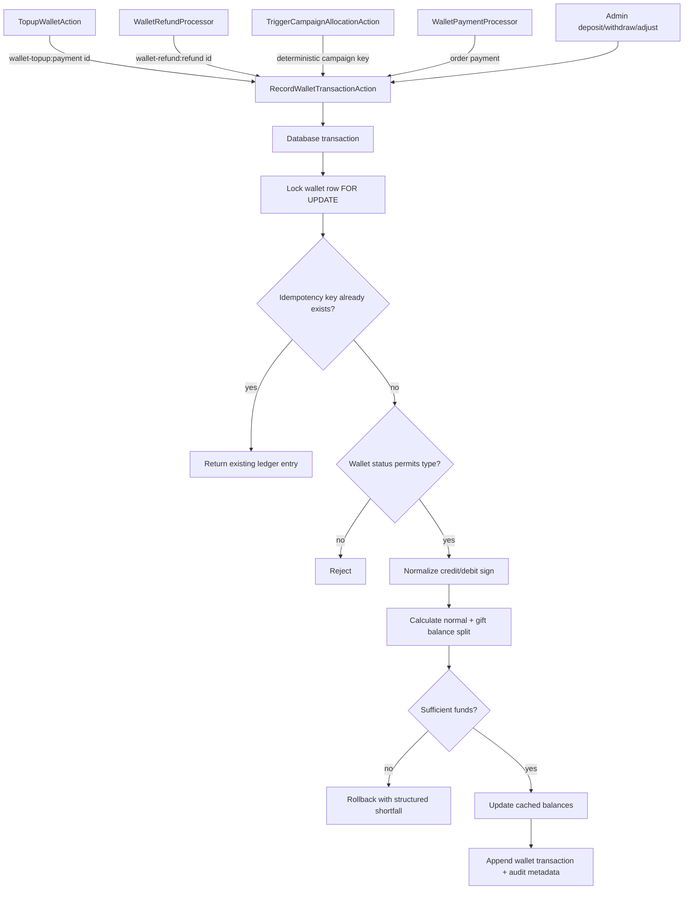
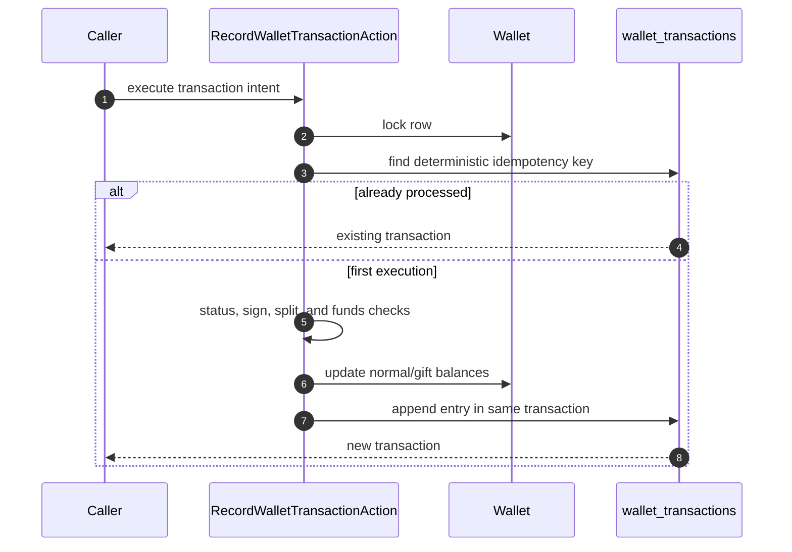
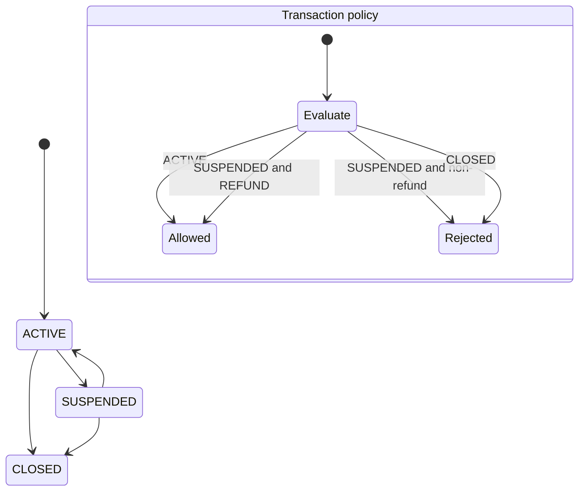

# Wallet boundaries

> Supporting architecture note. For contracts and current implementation, use `docs/Digestions/`, code, schema, and tests.

## Ledger model

Wallet balances are cached totals backed by an append-only transaction history. Every financial mutation goes through the shared transaction action; callers describe the source and intent but do not update balances directly.

## Invariants

- Lock the wallet row before checking funds and writing both the balance and ledger entry.
- Replayable operations carry deterministic idempotency keys derived from stable business identity, such as a payment, refund, or campaign allocation. Random request IDs do not provide financial idempotency.
- An existing idempotency key returns the existing transaction and performs no second balance change.
- Debits normalize to negative amounts and credits to positive amounts inside the transaction boundary.
- Order payment spends normal balance before gift balance. The split is recorded for audit and later financial reasoning.
- A suspended wallet accepts refunds only; a closed wallet accepts no transactions. Callers do not add local status bypasses.
- A wallet top-up is a payment with wallet-top-up purpose and customer ownership, not a dummy order. Payment completion routes to the ledger by purpose.
- Refunds restore funds through the same ledger action; they never edit the original transaction or balance directly.

## Failure behavior

| Failure | Required result |
|---|---|
| Concurrent debits | Row lock serializes the available-balance check; at most affordable debits succeed. |
| Repeated callback or job | Deterministic key returns the prior ledger entry. |
| Ledger insert fails | Balance update rolls back in the same database transaction. |
| Insufficient combined funds | No partial debit; return structured available/required/shortfall data. |
| Top-up payment belongs to another user | Reject before crediting any wallet. |

## Change checklist

- Test concurrency and idempotency, not only sequential happy paths.
- Preserve normal/gift split metadata for order debits.
- Keep source type and source ID stable enough for reconciliation.
- Never repair balances with a direct database update; use an explicit adjustment transaction.
