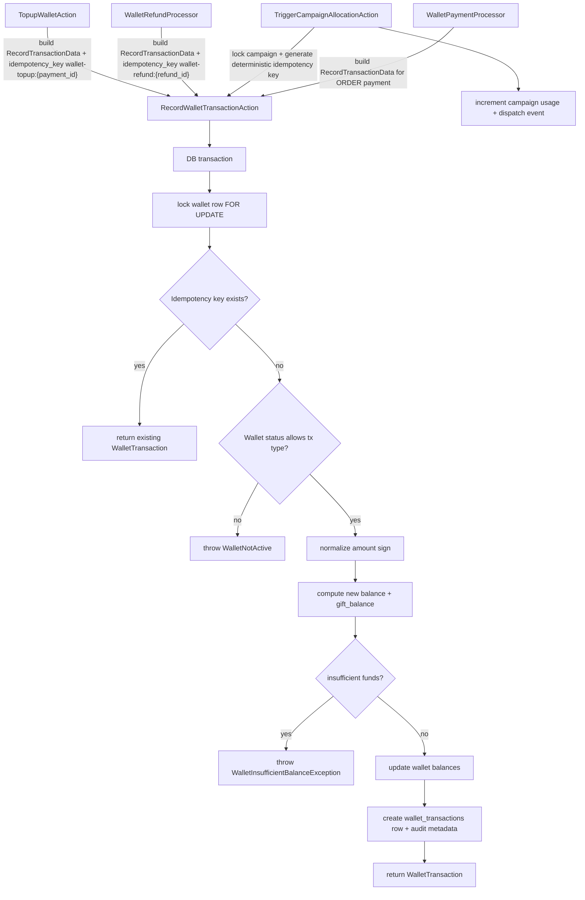
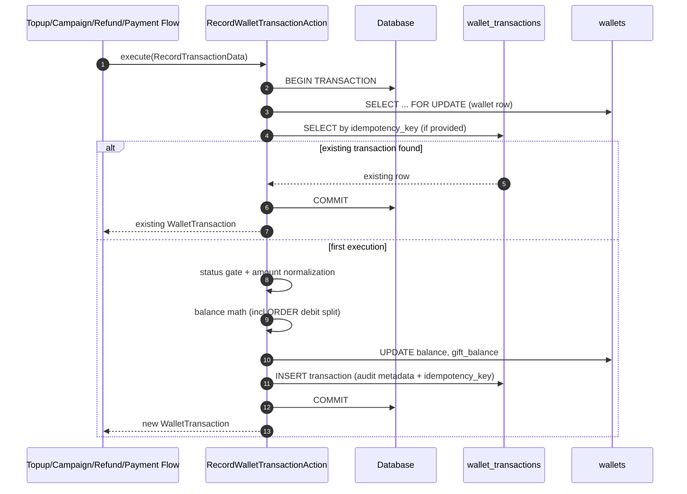
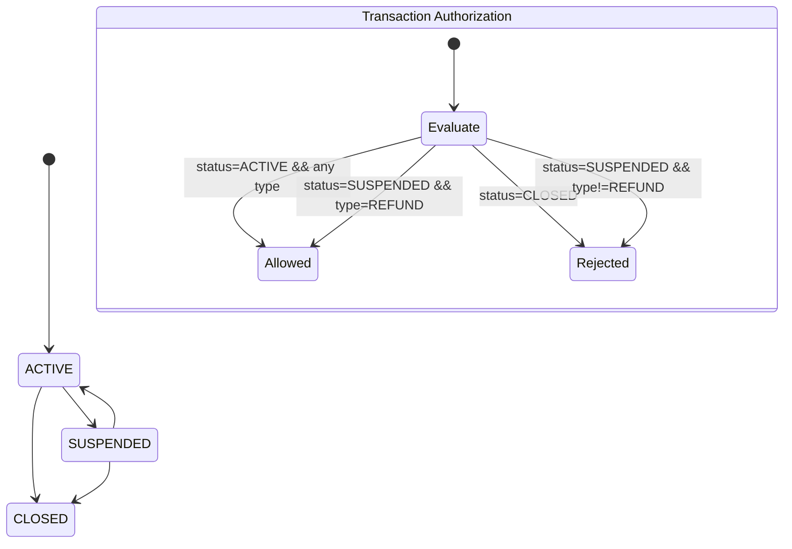

# Wallet Subsystem Architecture Reference

## 1) Subsystem Flow Diagram

## 2) Key Execution Path

## 3) State Transitions

## 4) Edge Case and Failure Matrix

| Case | Trigger | Current Handling | Result |
|---|---|---|---|
| Replay of same topup/refund/campaign request | Same deterministic `idempotency_key` | Query existing by key before write | Returns prior row, no double credit/debit |
| Concurrent writes to same wallet | Multiple requests in parallel | `DB::transaction` + wallet `lockForUpdate()` | Serialized balance updates |
| Duplicate campaign allocation race | Parallel campaign trigger | Campaign row lock + duplicate checks + idempotency key | Single allocation |
| Wallet suspended | Non-refund tx attempted | `canProcessTransactionForStatus()` | `WalletNotActive` thrown |
| Wallet closed | Any tx attempted | `canProcessTransactionForStatus()` | `WalletNotActive` thrown |
| Insufficient balance for payment/debit | Debit exceeds available funds | Explicit available/shortfall check | `WalletInsufficientBalanceException` |
| ORDER payment split across normal + gift balance | `PAYMENT` + `source_type=ORDER` | Split math (`from_balance`, `from_gift_balance`) | Correct dual-bucket debit |
| MySQL migration compatibility | PG-only partial index syntax | Conditional execute only on `pgsql` | Migration does not fail on MySQL |
| Missing user/wallet | Invalid input or orphan state | Explicit user/wallet existence checks | Domain exceptions thrown |

## 5) Developer Guardrails (Strict Do and Don\'t)

1. **Do** route all balance mutations through `RecordWalletTransactionAction`. **Don\'t** update `wallets.balance` directly in random services/controllers.
2. **Do** provide deterministic `idempotency_key` for replayable external events (payment webhook, campaign trigger, refund). **Don\'t** use random/non-repeatable keys.
3. **Do** keep `DB::transaction` + `lockForUpdate()` boundaries intact. **Don\'t** move reads/writes outside lock scope.
4. **Do** preserve wallet status policy (`active=all`, `suspended=refund-only`, `closed=none`). **Don\'t** add bypass logic per caller path.
5. **Do** keep migration/database changes cross-DB safe (pgsql-specific SQL behind driver checks) and test with Pest idempotency cases. **Don\'t** introduce raw PG-only SQL unguarded or skip regression tests.
