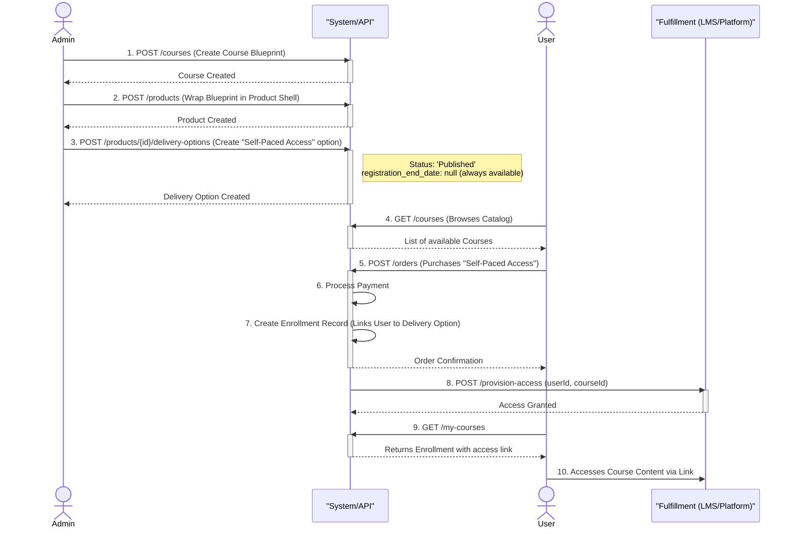

```mermaid
sequenceDiagram
    actor Admin
    participant "System/API"
    actor User
    participant "Fulfillment (LMS/Platform)"

    %% 1. Creation & Publication %%
    Admin->>"System/API": 1. POST /courses (Create Course Blueprint)
    activate "System/API"
    "System/API"-->>Admin: Course Created
    deactivate "System/API"

    Admin->>"System/API": 2. POST /products (Wrap Blueprint in Product Shell)
    activate "System/API"
    "System/API"-->>Admin: Product Created
    deactivate "System/API"

    Admin->>"System/API": 3. POST /products/{id}/delivery-options (Create "Self-Paced Access" option)
    activate "System/API"
    Note right of "System/API": Status: 'Published'<br>registration_end_date: null (always available)
    "System/API"-->>Admin: Delivery Option Created
    deactivate "System/API"

    %% 2. User Discovery & Purchase %%
    User->>"System/API": 4. GET /courses (Browses Catalog)
    activate "System/API"
    "System/API"-->>User: List of available Courses
    deactivate "System/API"

    User->>"System/API": 5. POST /orders (Purchases "Self-Paced Access")
    activate "System/API"
    "System/API"->>"System/API": 6. Process Payment
    "System/API"->>"System/API": 7. Create Enrollment Record (Links User to Delivery Option)
    "System/API"-->>User: Order Confirmation
    deactivate "System/API"

    %% 3. Access & Fulfillment %%
    "System/API"->>"Fulfillment (LMS/Platform)": 8. POST /provision-access (userId, courseId)
    activate "Fulfillment (LMS/Platform)"
    "Fulfillment (LMS/Platform)"-->>"System/API": Access Granted
    deactivate "Fulfillment (LMS/Platform)"

    User->>"System/API": 9. GET /my-courses
    activate "System/API"
    "System/API"-->>User: Returns Enrollment with access link
    deactivate "System/API"

    User->>"Fulfillment (LMS/Platform)": 10. Accesses Course Content via Link
```
