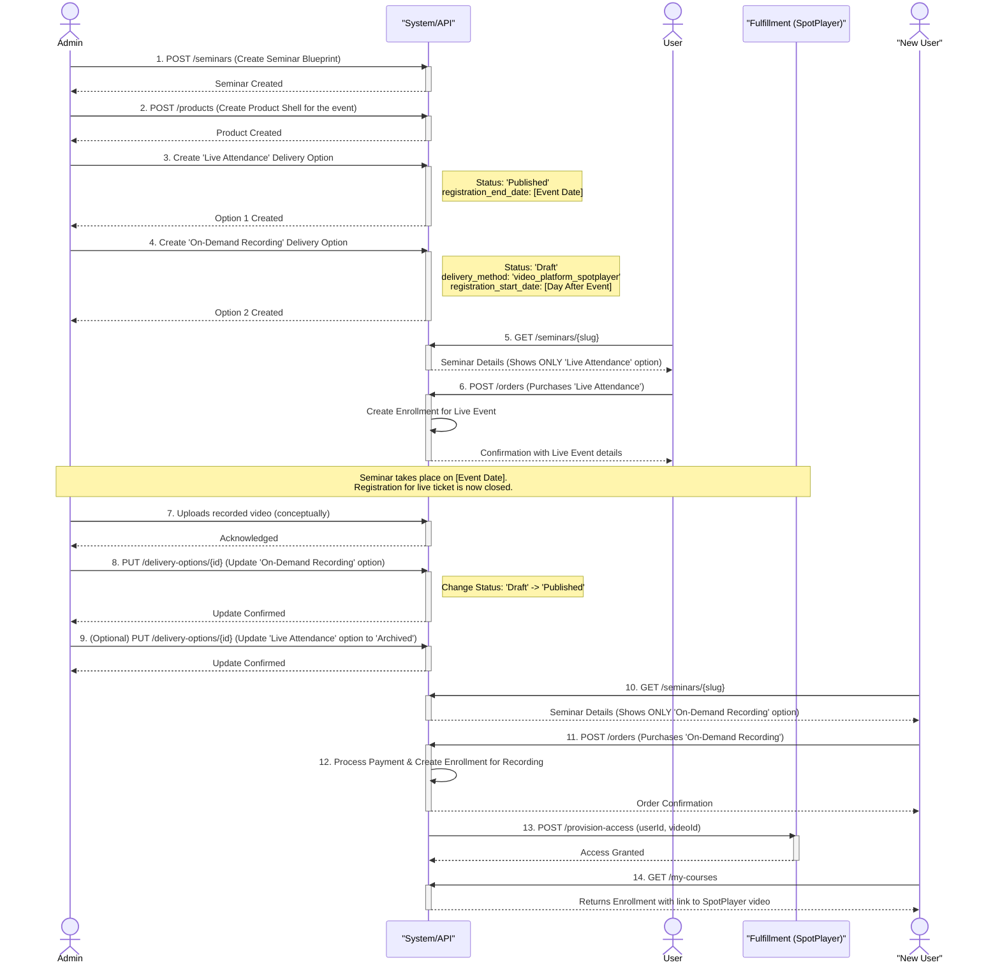

```mermaid
sequenceDiagram
    actor Admin
    participant "System/API"
    actor User
    participant "Fulfillment (SpotPlayer)"

    %% 1. Creation (Pre-Event) %%
    Admin->>"System/API": 1. POST /seminars (Create Seminar Blueprint)
    activate "System/API"
    "System/API"-->>Admin: Seminar Created
    deactivate "System/API"

    Admin->>"System/API": 2. POST /products (Create Product Shell for the event)
    activate "System/API"
    "System/API"-->>Admin: Product Created
    deactivate "System/API"

    Admin->>"System/API": 3. Create 'Live Attendance' Delivery Option
    activate "System/API"
    Note right of "System/API": Status: 'Published'<br>registration_end_date: [Event Date]
    "System/API"-->>Admin: Option 1 Created
    deactivate "System/API"

    Admin->>"System/API": 4. Create 'On-Demand Recording' Delivery Option
    activate "System/API"
    Note right of "System/API": Status: 'Draft'<br>delivery_method: 'video_platform_spotplayer'<br>registration_start_date: [Day After Event]
    "System/API"-->>Admin: Option 2 Created
    deactivate "System/API"

    %% 2. User Purchase (Pre-Event) %%
    User->>"System/API": 5. GET /seminars/{slug}
    activate "System/API"
    "System/API"-->>User: Seminar Details (Shows ONLY 'Live Attendance' option)
    deactivate "System/API"

    User->>"System/API": 6. POST /orders (Purchases 'Live Attendance')
    activate "System/API"
    "System/API"->>"System/API": Create Enrollment for Live Event
    "System/API"-->>User: Confirmation with Live Event details
    deactivate "System/API"

    %% --- EVENT HAPPENS --- %%
    Note over Admin, "Fulfillment (SpotPlayer)": Seminar takes place on [Event Date].<br>Registration for live ticket is now closed.

    %% 3. Admin Actions (Post-Event) %%
    Admin->>"System/API": 7. Uploads recorded video (conceptually)
    activate "System/API"
    "System/API"-->>Admin: Acknowledged
    deactivate "System/API"
    
    Admin->>"System/API": 8. PUT /delivery-options/{id} (Update 'On-Demand Recording' option)
    activate "System/API"
    Note right of "System/API": Change Status: 'Draft' -> 'Published'
    "System/API"-->>Admin: Update Confirmed
    deactivate "System/API"
    
    Admin->>"System/API": 9. (Optional) PUT /delivery-options/{id} (Update 'Live Attendance' option to 'Archived')
    activate "System/API"
    "System/API"-->>Admin: Update Confirmed
    deactivate "System/API"

    %% 4. New User Purchase (Post-Event) %%
    actor "New User"
    "New User"->>"System/API": 10. GET /seminars/{slug}
    activate "System/API"
    "System/API"-->>"New User": Seminar Details (Shows ONLY 'On-Demand Recording' option)
    deactivate "System/API"

    "New User"->>"System/API": 11. POST /orders (Purchases 'On-Demand Recording')
    activate "System/API"
    "System/API"->>"System/API": 12. Process Payment & Create Enrollment for Recording
    "System/API"-->>"New User": Order Confirmation
    deactivate "System/API"

    "System/API"->>"Fulfillment (SpotPlayer)": 13. POST /provision-access (userId, videoId)
    activate "Fulfillment (SpotPlayer)"
    "Fulfillment (SpotPlayer)"-->>"System/API": Access Granted
    deactivate "Fulfillment (SpotPlayer)"

    "New User"->>"System/API": 14. GET /my-courses
    activate "System/API"
    "System/API"-->>"New User": Returns Enrollment with link to SpotPlayer video
    deactivate "System/API"
```
