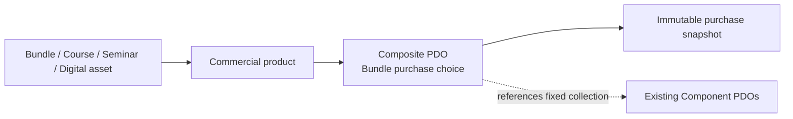
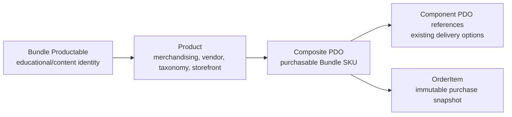

# Bundle frontend concept guide

This document explains what a Bundle represents in JeduShop and how it fits the existing three-layer catalog system. The frontend should use the existing admin and shop API contracts; this document does not introduce new endpoints or implementation steps.

## What a Bundle is

A Bundle is a first-class catalog offering that packages a fixed collection of existing educational offerings into one purchasable package.

A Bundle may contain Moodle courses, SpotPlayer courses or recordings, Seminars, and Digital Assets. The collection is fixed. A customer selects a complete Bundle option, such as Standard or Premium, but cannot substitute, remove, or add components inside that option.

> **Important:** A Bundle has one or more **Composite PDOs**. Each Composite PDO stores references to existing **Component PDOs**. Creating a Bundle does not create new Component PDOs or duplicate the underlying Course, Seminar, or Digital asset delivery records.

| Term | Meaning | Created for the Bundle? |
| --- | --- | --- |
| Bundle Productable | The package's content identity | Yes |
| Composite PDO | The Bundle's purchasable option and SKU | Yes |
| Component PDO | An existing Course, Seminar, or Digital asset delivery option referenced by the Composite PDO | No |
| OrderItem | The immutable purchase snapshot created after checkout | Yes, at purchase time |

The Bundle has its own catalog identity and presentation: name, description, media, owning department, categories, and aggregate price information. Its components remain individually recognizable so the customer can understand exactly what the package includes.

## Three-layer model

Bundle does not replace the existing catalog structure. It becomes another Productable within the same three layers already used by Course, Seminar, and Digital asset.

### 1. Productable: educational/content identity

The Productable owns the Bundle's educational/content identity. It describes the package itself rather than one delivery method.

This layer owns the Bundle-facing information:

- Bundle name and description
- Media
- Content metadata
- The identity of the included components

The Productable is not what the customer directly purchases. It is the subject shown on the Bundle listing and detail pages.

### 2. Product: merchandising and storefront identity

The Product owns the Bundle's merchandising, vendor, taxonomy, and storefront identity. It connects the Bundle content to the normal catalog concerns:

- Vendor (owning department)
- Sales term
- Visibility
- Publication status
- Merchandising and category placement
- Product-level presentation and availability

The Product gives the Bundle a place in the shop alongside other products. A Bundle has one vendor, even when its components come from multiple vendors.

The Bundle Product term describes when the package is sold. It does not replace the terms or schedules belonging to the component delivery options.

### 3. Composite PDO: purchasable Bundle SKU

The Bundle's Composite PDO is the purchasable SKU. It owns the Bundle option name, selling price, option availability, and the fixed collection of Component PDO references.

Each composite option defines:

- Its customer-facing option name, such as Standard or Premium
- Its SKU and selling price
- Its availability and publication state
- Its complete list of Component PDO references
- One Component Allocation for each referenced Component PDO

The customer selects the Composite PDO when purchasing. The customer does not select Component PDOs independently.

## How the layers appear together

The relationship can be read as:

**Bundle Productable → Bundle Product → Composite PDO → Component PDO references → OrderItem snapshot**

For example, a “Web Development Package” may be represented as:

- Bundle Productable: Web Development Package
- Product: the published commercial product owned by the Programming vendor
- Composite PDO: Premium Package
- Component PDO references: one existing Moodle Course PDO, one existing Seminar PDO, and one existing Digital asset PDO
- OrderItem: the immutable purchase snapshot created at checkout

The Composite PDO is the commercial choice shown to the customer. The referenced Component PDOs describe how each included item is actually delivered.

## What frontend developers should expect

On a Bundle listing or detail page, treat the Bundle as one catalog product. Use the Bundle-level values supplied by the API for its identity, availability, base value, selling price, discount amount, and discount percentage.

Show the Component PDO references as the contents of the package. Component details such as delivery method, provider, schedule, access window, teacher, and format explain what the customer receives; they do not become separate products to add to the cart.

When a Bundle has multiple Composite PDOs, show them as complete choices. Selecting one Composite PDO selects the entire fixed collection of existing Component PDOs represented by that option.

The frontend must not derive Bundle prices by adding or recalculating component prices. The API provides the Bundle Base Value, selling price, and savings directly. A component may have a zero allocation and must still be shown as an included component.

## Important distinction

The Bundle is the Productable identity. The Composite PDO is the purchasable Bundle choice. The Component PDOs are existing delivery options reused by reference inside that choice.

Therefore:

- The Bundle is presented as one product.
- The selected Composite PDO is added and purchased as one option.
- Component PDOs explain fulfillment but are not independently selected.
- Each referenced Component PDO still keeps its own delivery method, schedule, provider, access rules, Enrollment, and fulfillment behavior.

This preserves the existing catalog APIs and lets the frontend render Bundles using the same product, pricing, listing, detail, cart, and order concepts already implemented for the rest of the shop.
