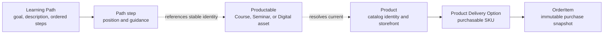

# Learning Path frontend concept guide

This document explains the Learning Path domain concept. A Learning Path is a guide that tells a customer which existing Products to study and in what order to reach a goal. It is not a purchasable entity.

The endpoint and field contract is [Learning-Path-API.yaml.txt](Learning-Path-API.yaml.txt). The existing Product, Product Delivery Option, cart, and checkout APIs remain responsible for catalog details and purchasing.

## What a Learning Path is

A Learning Path has:

- A title
- A description explaining the goal or outcome
- Optional media
- An ordered list of learning steps

Each step points to one stable existing Productable identity. The API may also resolve the current active Product for that Productable. The step gives the customer guidance; it does not create a new Product, Productable, delivery option, or purchase item.

The path may contain Courses, Seminars, or Digital Assets. The path itself does not have a price, capacity, registration window, provider, Enrollment, or checkout state.

## Relationship to the catalog model

Learning Path is a guide layered above the existing catalog. It does not become another Productable and does not alter the three-layer Product catalog model.

The distinction is important:

| Concept | Role in a Learning Path | Created by the path? |
| --- | --- | --- |
| Learning Path | Goal-oriented ordered guide | Yes |
| Path step | Position and optional step-specific guidance | Yes |
| Productable | Stable course, seminar, or Digital Asset content identity referenced by the path | No |
| Product | Current commercial Product for that Productable, when available | No |
| Product Delivery Option | Existing way to purchase/deliver that Product | No |
| OrderItem | Purchase record created through normal checkout | No |

## Domain behavior

Path step order is part of the contract and must come from the API. A path step is a reference to an existing Productable identity, with a position and optional path-specific guidance. It is not a copy of the Productable or Product.

Product status, availability, pricing, delivery choices, and provider details remain owned by the current Product and its existing Product Delivery Options. Products may be archived and replaced over time without changing the Learning Path's Productable reference.

The path is guidance, not an enrollment plan. Completing or purchasing one step does not automatically purchase, unlock, or enroll the customer in the next step. If a customer purchases a step, the existing Product and Product Delivery Option flow handles that purchase; the Learning Path itself never enters the cart.

If no current Product is available for a referenced Productable, the path does not create a substitute or override catalog rules. The Productable reference remains stable and can resolve to a later Product version.

## Admin meaning

Admin users manage the Learning Path identity and its ordered references. They can set the title, description, media, publication status, step positions, and optional step guidance. These are domain fields; the frontend owns their presentation.

When adding a step, the admin selects an existing Productable identity. The path editor must not create or duplicate a Product, Productable, or Product Delivery Option as a side effect.

The path may refer to Productables from different product types. The current Product remains the owner of its own vendor, catalog, delivery, price, availability, and publication rules.

Publishing a Learning Path makes the guide discoverable. It does not publish its referenced Products, make them purchasable, reserve capacity, or bypass any Product visibility and availability checks.

## Vocabulary to keep consistent

Use **Learning Path** for the ordered guide. Use **path step** for one position in that guide. Use **Productable** for the stable educational/content identity referenced by a step. Use **Product** for the current commercial catalog representation of that Productable. Use **Product Delivery Option** for the existing purchasable delivery choice belonging to that Product.

Do not call a Learning Path a Product, course, bundle, curriculum enrollment, or purchasable package. Do not call a path step a Product or Product Delivery Option. A path step references a Productable; any Product and Product Delivery Options are resolved separately for catalog and purchasing.
