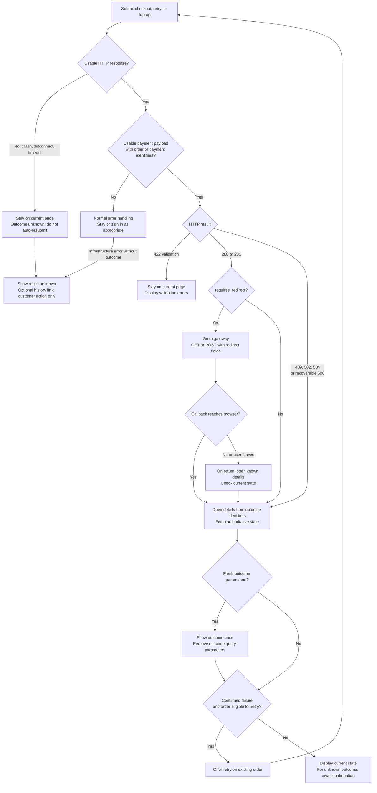

# Frontend payment flow

Messages live only in the standard API envelope's top-level `message`. Successful checkout keeps `data.order` and its gateway redirect fields, adding `requires_redirect`. Successful retry/top-up keep `data.payment` and gateway redirect fields. Extra outcome fields are omitted on success. Processing errors share recovery fields inside `data`: `status`, public `order_id`, UUID `payment_id`, `error_code`, and `can_retry`. Error responses contain no order/payment objects or gateway redirect fields; balance/shortfall metadata carries no duplicate outcome codes or identifiers.

## Grouped scenarios and next steps

| Scenario | Response / signal | Next frontend action | Message / recovery |
| --- | --- | --- | --- |
| Gateway accepts initiation | 201 checkout/top-up or 200 retry; `requires_redirect=true` (nested payment is pending) | **Go to gateway**, using redirect URL, method, and form data | Payment started; it has not succeeded yet. POST redirects require a form submission. |
| Payment completes immediately, including wallet or free order | 201 checkout or 200 retry; `requires_redirect=false` (nested payment completed) | **Go to order details** | Show success once. Fetch current balance and fulfillment state. |
| Payment awaits confirmation without a gateway redirect | 200/201; `requires_redirect=false` (nested payment pending) | **Go to order/top-up details** | Show pending verification, not success. |
| Validation or eligibility rejects the request before processing | 422 with `errors` and `data.status=failed`; no new Payment exists | **Stay on the current page** | Before order creation, IDs are null and the cart remains. Retry validation can include its existing order ID; 422 still means stay. |
| Saved order's payment is rejected locally, such as insufficient wallet balance | 409 with outcome data, `status=failed` | **Go to order details** | Order saved. Offer retry/change method only when `can_retry=true`. Wallet shortfall metadata remains available. |
| Gateway rejects initiation or returns an unusable response | 502 with outcome data; `failed` for a known rejection, `unknown` when confirmation was impossible | **Go to order/top-up details** | Show supplied outcome/message. Check current state before retrying an unknown outcome. |
| Gateway connection fails or times out | 504 with outcome data, `status=unknown` | **Go to order/top-up details** | Outcome could not be confirmed. Do not immediately initiate another payment. |
| Unexpected processing exception after Payment was saved, with a recoverable API response | 500 with outcome data and saved IDs (a free-order completion failure may have only the order ID) | **Go to order/top-up details** | Normally unknown. Internal exception text is not exposed. Already confirmed COMPLETED payments remain successful. |
| Callback verifies payment, records a decline, or catches an error | Browser redirect to configured details URL with `status`, `payment_id`, optional `error_code` | **Arrive at order/top-up details** | Show successful / failed / unknown notification once, then fetch authoritative state. Completed duplicate callbacks remain successful. |
| Authentication, authorization, missing resource, or throttling blocks request | 401 / 403 / 404 / 429, ordinary API error | **Use normal error handling** | Sign in, show denial/missing-resource message, or wait for rate-limit recovery. |
| Code/server/proxy crashes and returns no outcome data | Infrastructure 500/502/503/504 or any error with empty/HTML/malformed body or no usable payment outcome | **Stay on current page; offer history link** | Stay put and show “Result unknown.” An optional history link is a customer action, never an automatic redirect. Do not infer failure from the status. |
| Server stops, connection drops, or frontend request times out without a response | No usable HTTP response | **Stay on current page; offer history link** | Request may still run or may have committed. Show an unknown-result notice and a history link; do not auto-resubmit or guess an order. |
| Callback never reaches browser, or user closes/leaves gateway | No fresh callback outcome | **Open known order/top-up details when user returns** | Use IDs retained from initiation. Fetch state; do not invent a success/failure notification. |

A proxy/server handling the checkout API can return 500/502/503/504 without our payment outcome body. This is distinct from an upstream payment-gateway failure that our application catches and returns with structured outcome data. **A usable API payment payload and saved identifiers must be present** before applying the payment-specific redirect rule. A 200 response alone does not mean “go to gateway.” In Axios, the error envelope is `error.response.data`; its `.data` holds the outcome.

## JSON response examples

These fixtures are attached to the endpoint documentation through `@responseFile`. The top-level `message` is the only message field.

| HTTP / scenario | Order checkout / retry | Wallet top-up |
| --- | --- | --- |
| 201 checkout / 200 retry, gateway initiation | [Checkout 201](../resources/responses/shop/checkout/show.json), [Retry 200](../resources/responses/shop/order/retry-payment.json) | [Top-up 201](../resources/responses/shop/wallet/topup-result.json) |
| 201 / 200, immediate completion | [Checkout](../resources/responses/shop/payment/checkout-payment-successful.json), [Retry](../resources/responses/shop/payment/retry-payment-successful.json) | Not a supported immediate top-up flow |
| 422 validation | [Checkout](../resources/responses/shop/payment/payment-validation-error.json), [Retry](../resources/responses/shop/payment/retry-validation-error.json) | [Top-up validation](../resources/responses/shop/payment/payment-validation-error.json) |
| 409 local payment rejection | [Saved order / insufficient wallet balance](../resources/responses/shop/payment/order-payment-conflict.json) | Not applicable: wallet cannot fund a top-up |
| 502 gateway rejection | [Order](../resources/responses/shop/payment/order-gateway-rejected.json) | [Top-up](../resources/responses/shop/payment/topup-gateway-rejected.json) |
| 504 gateway timeout | [Order](../resources/responses/shop/payment/order-gateway-timeout.json) | [Top-up](../resources/responses/shop/payment/topup-gateway-timeout.json) |
| 500 recoverable processing exception | [Order](../resources/responses/shop/payment/order-processing-error.json), [Free order with no surviving Payment](../resources/responses/shop/payment/free-order-processing-error.json) | [Top-up](../resources/responses/shop/payment/topup-processing-error.json) |

Gateway callbacks return **302 with a Location header**, not one of these JSON bodies. Proxy/server crashes and infrastructure 503 responses have no guaranteed API body, so there is deliberately no fabricated recovery JSON example for them.

## Navigation diagram

## Detail-page notifications and crash recovery

Error/callback `status` is `pending`, `successful`, `failed`, or `unknown`. Successful describes the payment attempt, not necessarily the whole order's outstanding balance. Use the top-level `message` for localized API notifications and error `data.error_code` for specific UI handling. Success payloads carry no extra outcome status; inspect their nested order/payment state when needed.

When navigating from an error API response to details, pass `data.status`, `data.payment_id`, and optional `data.error_code`. For a successful API response, use `data.order.increment_id` for checkout, the request's existing order ID for retry, or `data.payment.uuid` for top-up; use the top-level message for a fresh notification. Callbacks already add them; old `payment`/`error` aliases remain. Show a notification only for a fresh outcome, fetch authoritative state, then remove outcome parameters so refresh does not repeat the toast. Query parameters never prove payment success.

Retain order/payment IDs before leaving for the gateway. If initial checkout's response is lost, there is no order ID and no reliable automatic way to correlate an order with that request. Stay on the page, show an unknown-result notice, and offer a history link so the customer can choose the record. This same stay-on-page rule applies to retry and top-up infrastructure failures; a previously known ID does not trigger automatic navigation. Do not assume the most recent order is the matching one. Keep automatic resubmission disabled. The API returns an explicit payment summary; internal notes, audit fields, raw gateway data, and loaded payment relationships are omitted. Checkout has no request idempotency key that would make blind network retries safe.

Never repeat checkout to recover a saved order. Use retry-payment on that order when allowed. API error responses expose `can_retry`; callback query parameters are only notification hints, so the detail page must verify current order eligibility (PENDING with positive balance) and confirmed failure before offering retry. The retry endpoint validates eligibility again. `can_retry=false` for unknown outcomes and top-ups (no top-up retry endpoint). Without a response, the frontend cannot know whether a crash occurred before order creation, after the order/cart transaction committed, or after gateway acceptance.

Full contract: [Shared Shop Payment Outcome](Digestions/DIGEST_API_INTERFACES.md#shared-shop-payment-outcome).

The current shop frontend reads `order.increment_id` and `order.payment_status.value` after checkout when there is no gateway redirect (`src/app/(site)/basket/page.jsx`). During gateway redirection it uses only redirect fields. Successful checkout retains the existing full order for compatibility; a future confirmation summary could use its items/totals, but the detail page should still fetch current state. Its current catch handler only displays errors: frontend integration must add the navigation rules above.
